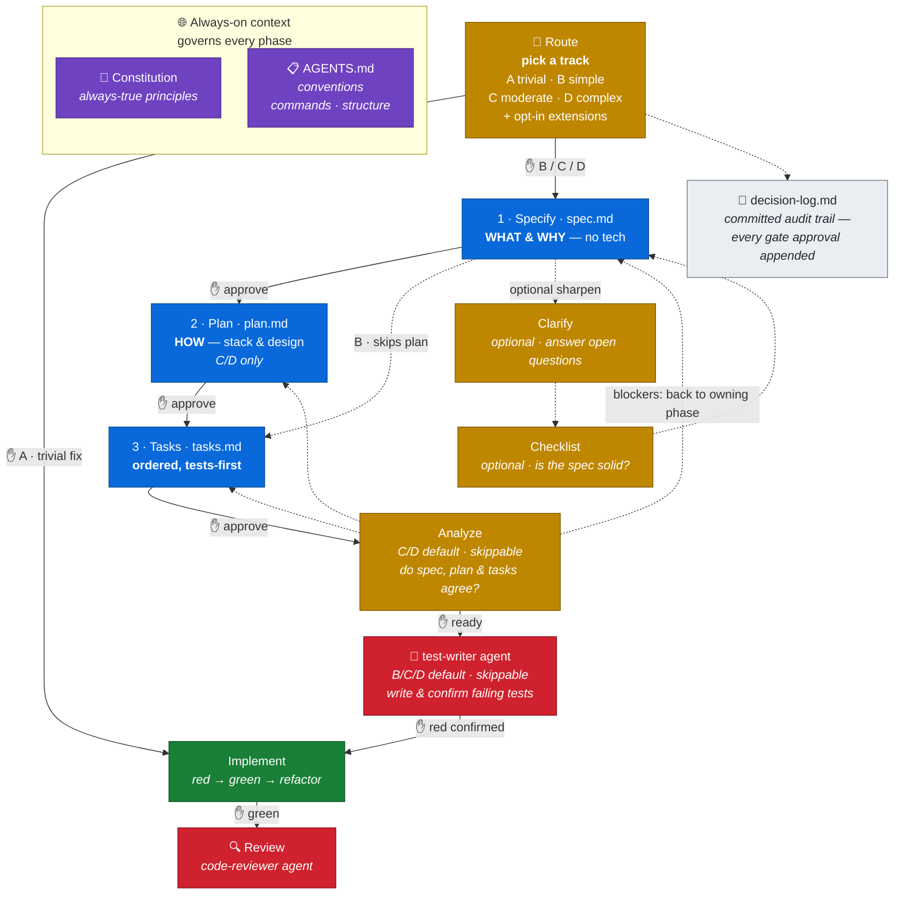
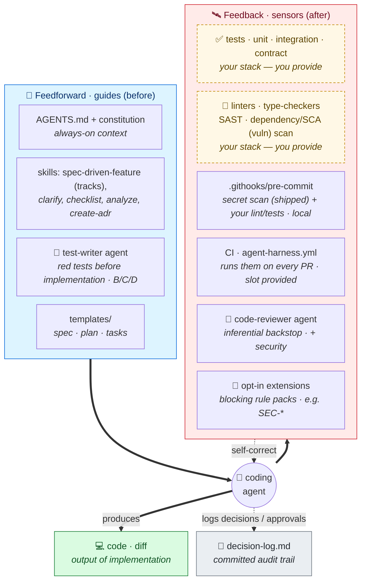

<div align="center">

# 🧭 Spec-Driven Development — Starter Kit

**A lightweight, customizable accelerator for spec-driven development with AI coding agents.**
No install, no CLI — just files you adapt to your stack. Specs before code, gates before merge, and a context file that earns every token.

[](LICENSE)
[](#-the-workflow)
[](#-whats-inside)
[](#)

</div>

---

Clone it, fill in the placeholders, and you have an opinionated structure for **spec-driven development (SDD)**: a constitution, gated spec→plan→tasks templates, skills and subagents, hooks, CI, and a `docs/` knowledge base on the engineering that makes agents actually productive.


## 🔄 The workflow

Each feature flows through gated phases. **An agent never advances a gate without explicit human approval.**



A spec that survives a framework swap unchanged was written correctly. Specs are pure **what/why**; the **how** lives in the plan; tasks are *generated* from both.

**What you actually run, and when:**

1. **Setup (once per project)** — run `init-project` to scan the codebase and generate both `AGENTS.md` and `memory/constitution.md` with approval gates, then `git config core.hooksPath .githooks` to arm the pre-commit sensor.
2. **Start a feature** — run `spec-driven-feature`. It first **right-sizes the work**: it proposes a workflow track (A · trivial direct fix / B · simple patch / C · moderate feature / D · complex architecture — this kit's own naming for adaptive depth; the four tracks are A · trivial / B · simple / C · moderate / D · complex) and scans `.agents/extensions/` for opt-in rule packs (e.g. a security baseline), and waits for you to approve the route. Then it scaffolds `specs/<NNN>/` (calling `start-feature.sh` on macOS/Linux or `start-feature.ps1` on Windows) and drafts `spec.md` (Specify), marking open questions as `[NEEDS CLARIFICATION]`. Trivial changes route to Track A and skip straight to implementation.
3. **(Optional) Sharpen the spec at the approval gate** — `spec-driven-feature` pauses after the draft and waits for you. If it left `[NEEDS CLARIFICATION]` markers or the spec needs tightening, run `clarify` and/or `checklist` *here*; otherwise just answer any open questions inline. Neither is a required step. **You approve the spec.**
4. **Plan, then tasks — same run** — once you approve, the skill continues *on its own* to `plan.md`, pauses for approval, then generates `tasks.md`. You don't relaunch it; each "stop" is a pause-for-approval, not an exit.
5. **Analyze (gate, Tracks C/D — default-on, skippable)** — before implementation, the skill runs `analyze`: a **non-destructive** cross-artifact check that every requirement maps to a task and that spec, plan, and tasks don't contradict each other. It *reports*, never rewrites — blockers loop back to **whichever phase owns the fix** (spec, plan, *or* tasks), then re-run; a clean verdict clears the gate. It runs by default on C/D but you can explicitly skip it (the skip is logged in `decision-log.md`, like skipping review). Skipped on Track A; a light spec↔tasks pass on Track B.
6. **Write failing tests (gate, Tracks B/C/D — default-on, skippable)** — after Analyze clears, the `test-writer` agent writes tests from the spec's acceptance criteria, runs them, and confirms each fails **for the right reason** (assertion failure or missing implementation — not an import error or typo). Errors ≠ valid red; the agent fixes those before reporting. For Track D brownfield areas, characterization tests are written first to pin current behaviour. Only once every test is confirmed red does the skill hand off to implementation. The skip (if the user chooses) is recorded in `decision-log.md`.
7. **Implement** — red → green → refactor, one story at a time; lean on the `debugger` agent when root cause is unclear.
8. **Review & commit** — the `code-reviewer` agent checks the diff against spec + constitution; on commit, `.githooks/pre-commit` blocks secrets, unresolved markers, tool-pointer files that grow past a pointer, and runs your lint/tests.

Steps 2–8 repeat per feature; step 1 is one-time (re-run `sync-agents-md` whenever the project drifts).

> [!NOTE]
> **Interrupted mid-feature?** Nothing is lost — your progress lives in that feature's committed `specs/<NNN>/spec.md`, `plan.md`, and `tasks.md`, which are the source of truth on resume. Each carries a **Status** header (`Draft` → `Approved — <who>, <date>`) the skill flips at each approval gate, so the documents themselves record exactly what's been ratified. To resume, just re-invoke `spec-driven-feature` for the same feature — there's no separate "start" command to re-run; the skill detects the existing feature folder, reads each document's Status (plus the filled-in body and the `decision-log.md` rows), and picks up at the first phase that isn't `Approved`. It never re-scaffolds or overwrites existing work — the scaffolding step only ever creates a *new* feature folder. A kill mid-phase is recoverable too: a half-written document still reads `Draft`, so that phase is simply resumed (recovery is phase-level, not line-level).

> [!NOTE]
> **The workflow is flexible — skills can be invoked standalone.** You don't have to enter at step 2. If you already have a spec written outside this kit, you can run `checklist` directly against it to assess quality, or `analyze` against an existing spec + plan + tasks to check cross-artifact consistency, without going through `spec-driven-feature` at all. Similarly, `clarify` can be run against any spec at any time — not just during the approval gate. `create-adr` and `amend-constitution` are always standalone. This composability means the kit works equally well as a full end-to-end workflow or as a set of individual tools you drop into an existing process.

## 🛰️ The harness model

The kit is built as a **harness** ([Martin Fowler's term](https://martinfowler.com/articles/harness-engineering.html)): *guides* that steer the agent before it acts, and *sensors* that catch it after. Both halves ship — you wire the sensors to your stack.



> [!NOTE]
> **Mechanize what you can, infer what you must.** A prose rule the agent re-reads each session is the *weakest* guarantee. Promote the ones that matter into a hook or a test..

## 🚀 Quickstart

```bash
git clone https://github.com/saptarshibasu/spec-driven-development.git my-project-sdd
cd my-project-sdd
```

A fresh clone already carries every directory, pointer, stub, and mirror —
there is no scaffolding step to run. (If you later edit or add a **skill** under
`.agents/skills/`, re-mirror it with `bash mirror-skills.sh` / `pwsh ./mirror-skills.ps1`;
if you edit or add an **agent** under `.agents/agents/`, re-generate the per-tool
copies with `bash mirror-agents.sh` / `pwsh ./mirror-agents.ps1`.)

Then, in order:

1. **Initialize the project** — run the `init-project` skill. It scans your codebase and generates both `AGENTS.md` (from `templates/agents.template.md`) and `memory/constitution.md` (from `templates/constitution.template.md`) with explicit approval gates before writing either file.
2. **Enable the hook** — `git config core.hooksPath .githooks`. (On Windows, Git runs the POSIX `pre-commit` via Git Bash; a native `pre-commit.ps1` is also provided.)
3. **Start a feature** — *"start a new feature: &lt;description&gt;"* (the `spec-driven-feature` skill).

## 📦 What's inside

### 🛠️ Skills — workflow commands *(canonical in `.agents/skills/`, mirrored to every tool)*

| Skill | When you run it | What it does |
|---|---|---|
| `init-project` | Once, at setup | Scans the codebase and generates both `AGENTS.md` and `memory/constitution.md` from their templates, with approval gates before writing either file. |
| `amend-constitution` | To amend the constitution | Updates `memory/constitution.md` section by section; use after `init-project` when principles need revisiting. |
| `sync-agents-md` | To re-sync after drift | Re-fills `AGENTS.md` from the actual repo when the project has changed significantly. |
| `create-adr` | To record an architecture decision | Finds the next ADR number, fills the template from your input, and writes `docs/adr/<NNNN-slug>.md` with approval before writing. |
| `spec-driven-feature` | Start of every feature | Proposes a workflow track (right-sizes depth) + scans opt-in extensions, then scaffolds `specs/<NNN>/` (via `start-feature.sh` / `.ps1`) and walks Specify → Plan → Tasks → Analyze → Tests (red) with approval gates. |
| `clarify` | After the spec draft | Surfaces spec ambiguities, asks a few targeted questions, writes answers back. |
| `checklist` | Before approving the spec | "Unit tests for the requirements" — complete, clear, consistent, measurable? |
| `analyze` | After tasks, before implementing (Tracks C/D) | Non-destructive cross-check of spec ↔ plan ↔ tasks: requirement→task coverage, contradictions, orphan/duplicate tasks, constitution alignment. Reports & routes; never rewrites. |

### 🤖 Agents — the sensor half *(canonical in `.agents/agents/`, generated into every tool)*

Defined once as Markdown in `.agents/agents/`; `mirror-agents` emits each tool's
native format — Claude `.md`, Copilot `.agent.md`, Codex `.toml`.

| Agent | Role |
|---|---|
| `code-reviewer` | Inferential review vs. spec, constitution, conventions, and baseline security. Read-only. |
| `test-writer` | Invoked after Analyze clears; writes tests from acceptance criteria, runs them, and confirms each fails for the right reason before implementation begins. Also handles characterization tests for brownfield areas (Track D). |
| `debugger` | Root-cause in its own discardable context; returns cause + minimal fix. |
| `docs-agent` | Keeps docs truthful and in sync with the code. |

### 🧩 Extensions — opt-in rule packs *(canonical in `.agents/extensions/`, loaded on demand)*

Blocking rule packs you layer onto a feature only when it needs them — so
constraints that don't belong in the always-loaded `AGENTS.md` or constitution
still get enforced. The `spec-driven-feature` skill scans the packs' tiny
opt-in prompts at feature start; a pack's full rules load only if you opt in, and
the `code-reviewer` agent then enforces them by rule ID.

| Pack | Opt in when | What it enforces |
|---|---|---|
| `security/baseline` | The feature touches auth, secrets, user data, external input, files, or network | `SEC-01`…`SEC-07`: input validation, authz, secret handling, data protection, output encoding, dependency hygiene, secure failure (directional reference — customise to your threat model). |

Add your own under `.agents/extensions/<category>/<pack>/` — format in
[`.agents/extensions/README.md`](.agents/extensions/README.md). Adapted from AWS Labs' AI-DLC (MIT-0).

#
<details>
<summary>📂 <b>Full directory layout</b></summary>

```
<project-root>/
├── AGENTS.md              # generated by init-project; keep short & specific
├── CLAUDE.md              # pointer → AGENTS.md
├── .mcp.json.example      # copy to .mcp.json; trim to 5–7 servers
│
├── .agents/               # canonical sources — edit here only (ADR-0001)
│   ├── skills/            # spec-driven-feature · clarify · checklist · analyze
│   │                      #   init-project · amend-constitution · sync-agents-md · create-adr
│   ├── agents/            # code-reviewer · test-writer · debugger · docs-agent
│   └── extensions/        # opt-in rule packs (e.g. security/baseline)
│
├── .claude/               # Claude Code: skills/ · agents/*.md (generated)
├── .github/               # Copilot: skills/ · agents/*.agent.md (generated)
│   └── workflows/
│       └── agent-harness.yml  # CI feedback harness
├── .codex/                # Codex: skills/ · agents/*.toml (generated)
│
├── .githooks/
│   ├── pre-commit         # secret scan · ambiguity block · thin-pointer guard · lint/test slot
│   └── pre-commit.ps1
│
├── memory/
│   └── constitution.md    # project-wide principles; governs every phase
│
├── templates/             # spec · plan · tasks · agents · constitution
│                          #   decision-log · checklist · research · data-model · quickstart
├── specs/
│   └── <NNN-feature>/     # spec.md · plan.md · tasks.md · decision-log.md
│       └── contracts/     # API/event contracts
│
├── docs/                  # engineering guides — read on demand, never auto-loaded
│   └── adr/               # architecture decision records
│
├── src/                   # your source tree
├── tests/                 # contract/ · integration/ · unit/ · characterization/
│
├── mirror-skills.sh/.ps1  # re-mirror .agents/skills/ → tool dirs after edits
└── mirror-agents.sh/.ps1  # re-generate .agents/agents/ → per-tool formats
```

</details>

## 🧱 Principles

These aren't advice buried in a doc — they're encoded in the constitution and `AGENTS.md` templates, then enforced by the gates, hooks, and CI. You ratify them once and every agent session inherits them.

> [!IMPORTANT]
> **`AGENTS.md` is the single source of truth.** Every tool file (`CLAUDE.md`, `.github/copilot-instructions.md`) is a thin pointer to it. Update one file, not four. The constitution is short on purpose — only what's *always* true. Conditional rules go in `AGENTS.md`; feature rules go in specs.

**Design-first — spec before code.** Every feature starts as a `spec.md` (*what & why*), then `plan.md` (*how*), then a generated `tasks.md`. No implementation until requirements are stable and approved. Spec ≠ plan — mixing *what* and *how* makes agents anchor on implementation before requirements are stable. Tasks are generated from a locked spec and reviewed plan, not hand-written. A spec that survives a framework swap unchanged was written correctly.

**Test-Driven Development is non-negotiable.** Write the test, watch it fail for the right reason, then implement — Red → Green → Refactor, every time. Never delete or weaken a failing test to make the suite pass. The `test-writer` agent writes tests from the spec before implementation begins and stops at red; it never writes implementation code.

**Characterization tests for brownfield.** Before changing any untested legacy behaviour, write tests that pin *current* behaviour first — so modifications are deliberate, not accidental. Brownfield areas are flagged in `AGENTS.md` and planned with the strongest model.

**Cross-artifact consistency before implementation.** The `analyze` gate (Tracks C/D) cross-checks spec, plan, and tasks as a set before a single line of code is written: every requirement maps to at least one task, no contradictions exist between artifacts, no orphan or duplicate tasks. It reports and routes blockers back to whichever phase owns the fix; it never rewrites artifacts itself. A clean verdict is the green light for implementation.

**Separate agents for separate concerns — each with its own context and model.** The coding agent implements; the `test-writer` writes tests in its own discardable context so test intent is never contaminated by implementation choices; the `debugger` isolates root cause in a throwaway context and returns only the minimal fix; the `code-reviewer` is read-only and checks the diff against spec, constitution, and conventions; the `docs-agent` keeps documentation truthful without touching code. Each agent gets only the context its role needs.

**Roles and model tiers — including model family.** Don't assume every agent should use the same model family as the coding agent. Different families have different strengths: a reasoning-specialist model (e.g. an o-series or thinking model) may outperform a general model for the `debugger` (root-cause analysis in unfamiliar code) and for `spec-driven-feature` on Tracks C/D (deep requirement and design reasoning); a model with strong long-context fidelity suits `code-reviewer` and `docs-agent`; a lighter, faster model is sufficient for routine Tasks-phase implementation. Within a family, use the lightest tier that can do the job reliably. Configure the model — family and tier — in each agent's definition file (the `model:` frontmatter in `.agents/agents/*.md`) so it's enforced at invocation, not left to the calling session to decide.

**Guides before, sensors after.** The harness has two halves: feedforward guides (AGENTS.md, constitution, specs, skills) that steer the agent before it acts, and feedback sensors (tests, linters, hooks, CI, code-reviewer) that catch it after. Promote the rules that matter most into hooks or tests — a prose rule re-read each session is the weakest guarantee.

**Right-size the workflow.** Not every change needs a full spec → plan → tasks pipeline. Track A (trivial) goes straight to implementation; Track B (simple patch) skips the plan; Tracks C/D get the full pipeline plus the Analyze gate. Match depth to risk.

**Opt-in over always-on.** Constraints that don't apply to every feature (e.g. security rules for features touching auth or user data) live in opt-in extensions, not in the always-loaded `AGENTS.md`. Load them only when needed, keep the base context lean.

**Context is a budget, not a junk drawer.** Every line in `AGENTS.md` must be something the agent cannot infer from training. Generic advice wastes tokens and can hurt performance. Prefer deleting a section to filling it with filler. Every artifact is a context unit — specs aren't auto-loaded; the agent pulls in only the one it needs.

**KV caching — put stable context first.** Inference APIs cache the prefix of the prompt. Structure your context so stable, rarely-changing content (constitution, AGENTS.md, system instructions) comes before dynamic content (the current task, spec excerpt). Maximising cache hits cuts latency and cost significantly on repeated agent calls within a session.

**Caveman prompts for non-negotiable rules.** Subtle prose hints are easy for a model to rationalize away. For rules that must hold without exception — never delete a failing test, never fabricate a method signature, always write the test before the implementation — state them bluntly and repeat them at the point of action. Specificity and repetition beat elegant prose when correctness is non-negotiable.

**Multi-repo — resolve, never guess.** When a dependency's source isn't visible in this repo, resolve it before writing code against it (sibling checkout → source jar → decompile → stop and ask) rather than fabricating a class, field, or method signature you can't see.

**MCP servers: fewer is better.** Each connected MCP server adds to every session's context overhead. Cap at 5–7; remove any server the project doesn't actively use.

**Hooks over prose.** A git hook that blocks a bad commit is more reliable than a rule that asks the agent to remember. Wire your highest-value rules into `.githooks/pre-commit` or CI so they're enforced mechanically, not by trust.

## Related: spec-kit & AI-DLC

[GitHub spec-kit](https://github.com/github/spec-kit) is GitHub's toolkit for spec-driven development — a `specify` CLI with commands for constitution, specify, clarify, plan, tasks, and implement, plus integrations for many AI coding agents.

[AWS Labs AI-DLC](https://github.com/awslabs/aidlc-workflows) (MIT-0) is a methodology shipped as agent steering/rules, built on adaptive workflows, flexible depth, and human-in-the-loop oversight. This kit's workflow tracks, opt-in extensions, and decision log are adapted from it.

## 📖 Further reading

- [Distilled AI-Assisted Development Guidelines](https://medium.com/@sapbasu/distilled-ai-assisted-development-guidelines-351ac9ab0154) — the companion article
- [Harness engineering for coding agents](https://martinfowler.com/articles/harness-engineering.html) — Martin Fowler
- [Effective context engineering for AI agents](https://www.anthropic.com/engineering/effective-context-engineering-for-ai-agents) — Anthropic
- [Agent READMEs: an empirical study of context files](https://arxiv.org/abs/2511.12884) — what helps vs. hurts
- [How to write a great AGENTS.md](https://github.blog/ai-and-ml/github-copilot/how-to-write-a-great-agents-md-lessons-from-over-2500-repositories/) — GitHub, 2,500+ repos
- [AI-DLC — AWS Labs adaptive workflows](https://github.com/awslabs/aidlc-workflows) (MIT-0) — the methodology this kit's tracks, extensions, and decision log draw from ([methodology blog](https://aws.amazon.com/blogs/devops/ai-driven-development-life-cycle/))
- [New spec types: fix bugs and build on top of existing apps](https://kiro.dev/blog/specs-bugfix-and-design-first/) — Kiro on bug-fix specs (current / expected / unchanged behavior); relevant to this kit's Track B patch flow
- [spec-kit](https://github.com/github/spec-kit) · [awesome-copilot](https://github.com/github/awesome-copilot)

---

<div align="center">

Licensed under [Apache 2.0](LICENSE) · Contributions welcome

</div>