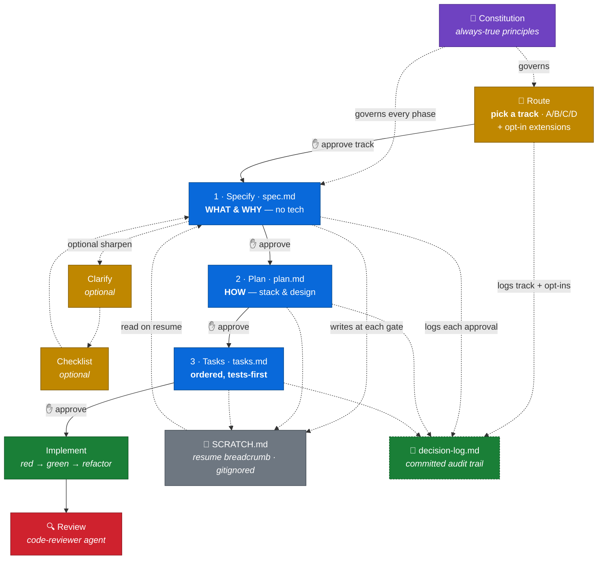
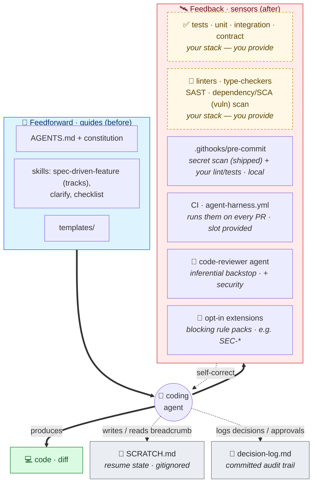

<div align="center">

# 🧭 Spec-Driven Development — Starter Kit

**A lightweight, customizable accelerator for spec-driven development with AI coding agents.**
No install, no CLI — just files you adapt to your stack. Specs before code, gates before merge, and a context file that earns every token.

[](LICENSE)
[](#-the-workflow)
[](#-whats-inside)
[](#)

</div>

---

Clone it, fill in the placeholders, and you have an opinionated structure for **spec-driven development (SDD)**: a constitution, gated spec→plan→tasks templates, skills and subagents, hooks, CI, and a `docs/` knowledge base on the engineering that makes agents actually productive.

> [!TIP]
> **The one idea behind everything here:** an agent's context is a budget, not a junk drawer. Every line in `AGENTS.md`, every doc, every tool must earn its place. Empirical studies find kitchen-sink context files can *hurt* performance — so this kit optimizes for *the smallest set of high-signal guidance that makes the agent act correctly.*

## 🔄 The workflow

Each feature flows through gated phases. **An agent never advances a gate without explicit human approval.**



A spec that survives a framework swap unchanged was written correctly. Specs are pure **what/why**; the **how** lives in the plan; tasks are *generated* from both.

**What you actually run, and when:**

1. **Setup (once per project)** — run `create-constitution` to ratify principles, `sync-agents-md` to fill `AGENTS.md` from your repo, then `git config core.hooksPath .githooks` to arm the pre-commit sensor.
2. **Start a feature** — run `spec-driven-feature`. It first **right-sizes the work**: it proposes a workflow track (A direct fix / B patch / C feature / D architecture) and scans `.agents/extensions/` for opt-in rule packs (e.g. a security baseline), and waits for you to approve the route. Then it scaffolds `specs/<NNN>/` (calling `start-feature.sh` on macOS/Linux or `start-feature.ps1` on Windows) and drafts `spec.md` (Specify), marking open questions as `[NEEDS CLARIFICATION]`. Trivial changes route to Track A and skip straight to implementation.
3. **(Optional) Sharpen the spec at the approval gate** — `spec-driven-feature` pauses after the draft and waits for you. If it left `[NEEDS CLARIFICATION]` markers or the spec needs tightening, run `clarify` and/or `checklist` *here*; otherwise just answer any open questions inline. Neither is a required step. **You approve the spec.**
4. **Plan, then tasks — same run** — once you approve, the skill continues *on its own* to `plan.md`, pauses for approval, then generates `tasks.md`. You don't relaunch it; each "stop" is a pause-for-approval, not an exit.
5. **Implement** — red → green → refactor, one story at a time; lean on the `test-writer` and `debugger` agents as needed.
6. **Review & commit** — the `code-reviewer` agent checks the diff against spec + constitution; on commit, `.githooks/pre-commit` blocks secrets, unresolved markers, and runs your lint/tests.

Steps 2–6 repeat per feature; step 1 is one-time (re-run `sync-agents-md` whenever the project drifts).

> [!NOTE]
> **Interrupted mid-feature?** Nothing is lost — your progress lives in that feature's `specs/<NNN>/spec.md`, `plan.md`, and `tasks.md`, and the skill keeps a gitignored `SCRATCH.md` breadcrumb updated **at each gate** (current phase, what's next, open questions). To resume, just re-invoke `spec-driven-feature` for the same feature (don't re-run `start-feature` — it won't overwrite an existing feature): it reads the breadcrumb plus the filled-in documents and picks up at the next unapproved gate. Even an abrupt kill mid-phase is covered, because the breadcrumb is written as it goes — not only on a graceful stop.

## 🛰️ The harness model

The kit is built as a **harness** ([Martin Fowler's term](https://martinfowler.com/articles/harness-engineering.html)): *guides* that steer the agent before it acts, and *sensors* that catch it after. Both halves ship — you wire the sensors to your stack.



> [!NOTE]
> **Mechanize what you can, infer what you must.** A prose rule the agent re-reads each session is the *weakest* guarantee. Promote the ones that matter into a hook or a test. See [`docs/harness-engineering.md`](docs/harness-engineering.md).

## 🚀 Quickstart

```bash
git clone https://github.com/saptarshibasu/spec-driven-development.git my-project-sdd
cd my-project-sdd
```

A fresh clone already carries every directory, pointer, stub, and mirror —
there is no scaffolding step to run. (If you later edit or add a **skill** under
`.agents/skills/`, re-mirror it with `bash mirror-skills.sh` / `pwsh ./mirror-skills.ps1`;
if you edit or add an **agent** under `.agents/agents/`, re-generate the per-tool
copies with `bash mirror-agents.sh` / `pwsh ./mirror-agents.ps1`.)

Then, in order:

1. **Fill in `AGENTS.md`** — replace every `[placeholder]` with a fact specific to your repo; delete anything an agent could infer from training. (The `sync-agents-md` skill can draft this from your codebase.)
2. **Ratify the constitution** — run the `create-constitution` skill (or edit `memory/constitution.md`).
3. **Add domain terms** to `docs/glossary.md`.
4. **Enable the hook** — `git config core.hooksPath .githooks`. (On Windows, Git runs the POSIX `pre-commit` via Git Bash; a native `pre-commit.ps1` is also provided.)
5. **Start a feature** — *"start a new feature: &lt;description&gt;"* (the `spec-driven-feature` skill).

## 📦 What's inside

### 🛠️ Skills — workflow commands *(canonical in `.agents/skills/`, mirrored to every tool)*

| Skill | When you run it | What it does |
|---|---|---|
| `create-constitution` | Once, at setup | Builds/ratifies `memory/constitution.md` from the template. |
| `sync-agents-md` | At setup, then to re-sync | Fills in `AGENTS.md` + `docs/glossary.md` from the actual repo, and later flags drift — evidence-based, never guessed. |
| `spec-driven-feature` | Start of every feature | Proposes a workflow track (right-sizes depth) + scans opt-in extensions, then scaffolds `specs/<NNN>/` (via `start-feature.sh` / `.ps1`) and walks Specify → Plan → Tasks with approval gates. |
| `clarify` | After the spec draft | Surfaces spec ambiguities, asks a few targeted questions, writes answers back. |
| `checklist` | Before approving the spec | "Unit tests for the requirements" — complete, clear, consistent, measurable? |

### 🤖 Agents — the sensor half *(canonical in `.agents/agents/`, generated into every tool)*

Defined once as Markdown in `.agents/agents/`; `mirror-agents` emits each tool's
native format — Claude `.md`, Copilot `.agent.md`, Codex `.toml` (ADR-0001).

| Agent | Role |
|---|---|
| `code-reviewer` | Inferential review vs. spec, constitution, conventions, and baseline security. Read-only. |
| `test-writer` | Red-first tests from a spec/task; stops at red. |
| `debugger` | Root-cause in its own discardable context; returns cause + minimal fix. |
| `docs-agent` | Keeps docs truthful and in sync with the code. |

### 🧩 Extensions — opt-in rule packs *(canonical in `.agents/extensions/`, loaded on demand)*

Blocking rule packs you layer onto a feature only when it needs them — so
constraints that don't belong in the always-loaded `AGENTS.md` or constitution
still get enforced. The `spec-driven-feature` skill scans the packs' tiny
opt-in prompts at feature start; a pack's full rules load only if you opt in, and
the `code-reviewer` agent then enforces them by rule ID.

| Pack | Opt in when | What it enforces |
|---|---|---|
| `security/baseline` | The feature touches auth, secrets, user data, external input, files, or network | `SEC-01`…`SEC-07`: input validation, authz, secret handling, data protection, output encoding, dependency hygiene, secure failure (directional reference — customise to your threat model). |

Add your own under `.agents/extensions/<category>/<pack>/` — format in
[`.agents/extensions/README.md`](.agents/extensions/README.md). Adapted from AWS Labs' AI-DLC (MIT-0); see [ADR-0002](docs/adr/0002-adaptive-workflow-and-extensions.md).

### 📚 Engineering reference — `docs/` *(read on demand, never auto-loaded)*

| Read when you're… | Doc |
|---|---|
| Deciding what goes in AGENTS.md vs. a doc vs. a spec | [`context-engineering.md`](docs/context-engineering.md) |
| Setting up guides + sensors around the agent | [`harness-engineering.md`](docs/harness-engineering.md) |
| Right-sizing the pipeline (tracks) + opt-in rule packs | [`adaptive-workflow-and-extensions.md`](docs/adaptive-workflow-and-extensions.md) |
| Cutting cost/latency without cutting the controls | [`token-efficiency.md`](docs/token-efficiency.md) |
| Choosing a model per phase | [`model-selection-and-token-optimization-in-sdd.md`](docs/model-selection-and-token-optimization-in-sdd.md) |
| Stopping agents writing slow code (N+1, per-row loops) | [`efficient-code-generation-and-performance-pitfalls.md`](docs/efficient-code-generation-and-performance-pitfalls.md) |
| Connecting MCP servers (and the 5–7 cap) | [`mcp.md`](docs/mcp.md) |
| Turning prose rules into enforced hooks | [`hooks.md`](docs/hooks.md) |

<details>
<summary>📂 <b>Full directory layout</b></summary>

```
<project-root>/
├── AGENTS.md                      # Always-loaded canonical instructions — keep short & specific
├── CLAUDE.md                      # Thin pointer → AGENTS.md
├── .mcp.json.example              # Curated MCP config — copy to .mcp.json, trim (docs/mcp.md)
├── mirror-skills.sh / .ps1        # Re-mirror canonical skills → .claude/.github/.codex after edits
├── mirror-agents.sh / .ps1        # Re-generate canonical agents → per-tool native formats after edits
│
├── .agents/                       # CANONICAL sources — mirror scripts propagate → .claude/.github/.codex
│   ├── skills/                    #   skills, mirrored byte-for-byte (edit here only — ADR-0001)
│   │   ├── spec-driven-feature/  ·  clarify/  ·  checklist/  ·  create-constitution/  ·  sync-agents-md/
│   ├── agents/                    #   agents, GENERATED per tool (edit here only — ADR-0001)
│   │   ├── code-reviewer.md  ·  test-writer.md  ·  debugger.md  ·  docs-agent.md
│   └── extensions/                #   opt-in rule packs, loaded on demand (e.g. security/baseline)
│
├── .githooks/pre-commit / .ps1    # Secret scan · spec-ambiguity block · lint/test slot
│
├── .github/                       # Copilot: copilot-instructions.md, instructions/, skills/,
│   │                              #   agents/*.agent.md (generated)
│   └── workflows/agent-harness.yml#   Example CI feedback harness
├── .claude/                       # Claude Code: skills/ + agents/*.md (generated)
├── .codex/                        # Codex: skills/ + agents/*.toml (generated)
│
├── memory/constitution.md         # Project-wide principles (rarely changes)
│
├── templates/                     # spec · plan · tasks · decision-log · constitution · checklist
│   └── research · data-model · quickstart      # optional per-feature artifacts
│
├── specs/<NNN-feature>/           # spec.md · plan.md · tasks.md · decision-log.md (committed audit trail)
│   └── contracts/                 # this feature's API/event contracts
│
├── docs/                          # 5 engineering guides + mcp.md + hooks.md + glossary.md + adr/
├── src/                           # your source tree
└── tests/                         # contract · integration · unit · characterization
```

</details>

## 🧱 Principles it bakes in

These aren't advice buried in a doc — they're encoded in the constitution and `AGENTS.md` templates, then enforced by the gates, hooks, and CI. You ratify them once and every agent session inherits them.

- **Design-first — spec before code.** Every feature starts as `spec.md` (*what & why*), then `plan.md` (*how*), then a generated `tasks.md`; no implementation until the requirements are stable. A spec that survives a framework swap unchanged was written correctly.
- **Test-Driven Development (non-negotiable).** Write the test, watch it fail for the right reason, then implement — Red → Green → Refactor, every time. Never delete or weaken a failing test to make the suite pass. ([Constitution, Article III](memory/constitution.md))
- **Characterization tests for brownfield.** Before changing any untested legacy behaviour, first write tests that capture *current* behaviour — so you change it deliberately, not by accident. Brownfield areas are flagged in `AGENTS.md` and planned with the strongest model. ([Testing Discipline](AGENTS.md#testing-discipline))
- **Multi-repo — resolve, never guess.** When a dependency's source isn't visible in this repo, resolve it before writing code against it (sibling checkout → source jar → decompile → stop and ask) rather than fabricating a class, field, or method signature you can't see. ([Multi-Repo / Cross-Boundary Notes](AGENTS.md#multi-repo--cross-boundary-notes))
- **Simplicity / anti-abstraction.** No speculative "might need it later" abstraction without a current, concrete requirement; use the framework directly unless a wrapper is justified in writing. ([Constitution, Article V](memory/constitution.md))

## 💡 Why it's structured this way

> [!IMPORTANT]
> **`AGENTS.md` is the single source of truth.** Every tool file (`CLAUDE.md`, `.github/copilot-instructions.md`) is a thin pointer to it. Update one file, not four. ([ADR-0001](docs/adr/0001-agents-md-single-source-of-truth.md))

- **Spec ≠ plan.** Mixing *what* and *how* makes agents anchor on implementation before requirements are stable.
- **Tasks are generated, not hand-written.** With a locked spec and reviewed plan, an agent derives `tasks.md` deterministically.
- **The constitution is short on purpose.** Only what's *always* true. Conditional rules go in `AGENTS.md`; feature rules go in specs.
- **Every artifact is a context unit.** Specs aren't auto-loaded — the agent pulls in only the one it needs. ([`context-engineering.md`](docs/context-engineering.md))

## Related: spec-kit & AI-DLC

[GitHub spec-kit](https://github.com/github/spec-kit) is GitHub's toolkit for spec-driven development — a `specify` CLI with commands for constitution, specify, clarify, plan, tasks, and implement, plus integrations for many AI coding agents.

[AWS Labs AI-DLC](https://github.com/awslabs/aidlc-workflows) (MIT-0) is a methodology shipped as agent steering/rules, built on adaptive workflows, flexible depth, and human-in-the-loop oversight. This kit's [workflow tracks, opt-in extensions, and decision log](docs/adaptive-workflow-and-extensions.md) are adapted from it — see [ADR-0002](docs/adr/0002-adaptive-workflow-and-extensions.md).

## 📖 Further reading

- [Distilled AI-Assisted Development Guidelines](https://medium.com/@sapbasu/distilled-ai-assisted-development-guidelines-351ac9ab0154) — the companion article
- [Harness engineering for coding agents](https://martinfowler.com/articles/harness-engineering.html) — Martin Fowler
- [Effective context engineering for AI agents](https://www.anthropic.com/engineering/effective-context-engineering-for-ai-agents) — Anthropic
- [Agent READMEs: an empirical study of context files](https://arxiv.org/abs/2511.12884) — what helps vs. hurts
- [How to write a great AGENTS.md](https://github.blog/ai-and-ml/github-copilot/how-to-write-a-great-agents-md-lessons-from-over-2500-repositories/) — GitHub, 2,500+ repos
- [AI-DLC — AWS Labs adaptive workflows](https://github.com/awslabs/aidlc-workflows) (MIT-0) — the methodology this kit's tracks, extensions, and decision log draw from ([methodology blog](https://aws.amazon.com/blogs/devops/ai-driven-development-life-cycle/))
- [spec-kit](https://github.com/github/spec-kit) · [awesome-copilot](https://github.com/github/awesome-copilot)

---

<div align="center">

Licensed under [Apache 2.0](LICENSE) · Contributions welcome

</div>
