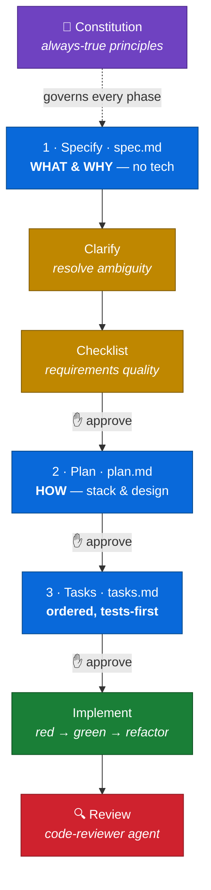
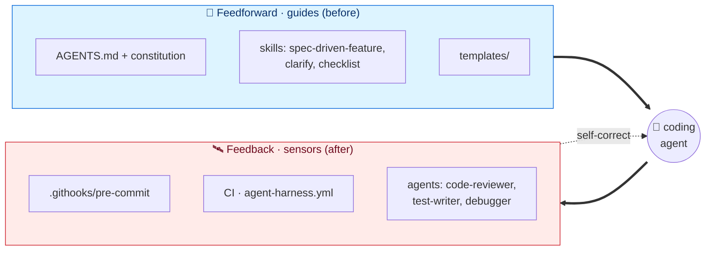

<div align="center">

# 🧭 Spec-Driven Development — Starter Kit

**A ready-to-copy harness for building software with AI coding agents.**
Specs before code, gates before merge, and a context file that earns every token.

[](LICENSE)
[](#-the-workflow)
[](#-whats-inside)
[](#)

</div>

---

Clone it, fill in the placeholders, and you have an opinionated structure for **spec-driven development (SDD)**: a constitution, gated spec→plan→tasks templates, skills and subagents, hooks, CI, and a `docs/` knowledge base on the engineering that makes agents actually productive.

> [!TIP]
> **The one idea behind everything here:** an agent's context is a budget, not a junk drawer. Every line in `AGENTS.md`, every doc, every tool must earn its place. Empirical studies find kitchen-sink context files can *hurt* performance — so this kit optimizes for *the smallest set of high-signal guidance that makes the agent act correctly.*

## 🔄 The workflow

Each feature flows through gated phases. **An agent never advances a gate without explicit human approval.**



A spec that survives a framework swap unchanged was written correctly. Specs are pure **what/why**; the **how** lives in the plan; tasks are *generated* from both.

## 🛰️ The harness model

The kit is built as a **harness** ([Martin Fowler's term](https://martinfowler.com/articles/harness-engineering.html)): *guides* that steer the agent before it acts, and *sensors* that catch it after. Both halves ship — you wire the sensors to your stack.



> [!NOTE]
> **Mechanize what you can, infer what you must.** A prose rule the agent re-reads each session is the *weakest* guarantee. Promote the ones that matter into a hook or a test. See [`docs/harness-engineering.md`](docs/harness-engineering.md).

## 🚀 Quickstart

```bash
git clone https://github.com/saptarshibasu/spec-driven-development.git my-project-sdd
cd my-project-sdd
bash setup.sh        # scaffolds dirs, mirrors skills, seeds stubs (idempotent)
```

Then, in order:

1. **Fill in `AGENTS.md`** — replace every `[placeholder]` with a fact specific to your repo; delete anything an agent could infer from training.
2. **Ratify the constitution** — run the `create-constitution` skill (or edit `memory/constitution.md`).
3. **Add domain terms** to `docs/glossary.md`.
4. **Enable the hook** — `git config core.hooksPath .githooks`.
5. **Start a feature** — *"start a new feature: &lt;description&gt;"* (the `spec-driven-feature` skill).

## 📦 What's inside

### 🛠️ Skills — workflow commands *(canonical in `.agents/skills/`, mirrored to every tool)*

| Skill | Does |
|---|---|
| `spec-driven-feature` | Scaffolds a feature and walks Specify → Plan → Tasks with approval gates. |
| `clarify` | Surfaces spec ambiguities, asks a few targeted questions, writes answers back. |
| `checklist` | "Unit tests for the requirements" — complete, clear, consistent, measurable? |
| `create-constitution` | Builds/ratifies `memory/constitution.md` from the template. |

### 🤖 Agents — the sensor half *(examples in `.claude/agents/`; adapt per runtime)*

| Agent | Role |
|---|---|
| `code-reviewer` | Inferential review vs. spec, constitution, conventions. Read-only. |
| `test-writer` | Red-first tests from a spec/task; stops at red. |
| `debugger` | Root-cause in its own discardable context; returns cause + minimal fix. |
| `docs-agent` | (Copilot) keeps docs truthful and in sync with the code. |

### 📚 Engineering reference — `docs/` *(read on demand, never auto-loaded)*

| Read when you're… | Doc |
|---|---|
| Deciding what goes in AGENTS.md vs. a doc vs. a spec | [`context-engineering.md`](docs/context-engineering.md) |
| Setting up guides + sensors around the agent | [`harness-engineering.md`](docs/harness-engineering.md) |
| Cutting cost/latency without cutting the controls | [`token-efficiency.md`](docs/token-efficiency.md) |
| Choosing a model per phase | [`model-selection-and-token-optimization-in-sdd.md`](docs/model-selection-and-token-optimization-in-sdd.md) |
| Stopping agents writing slow code (N+1, per-row loops) | [`efficient-code-generation-and-performance-pitfalls.md`](docs/efficient-code-generation-and-performance-pitfalls.md) |
| Connecting MCP servers (and the 5–7 cap) | [`mcp.md`](docs/mcp.md) |
| Turning prose rules into enforced hooks | [`hooks.md`](docs/hooks.md) |

<details>
<summary>📂 <b>Full directory layout</b></summary>

```
<project-root>/
├── AGENTS.md                      # Always-loaded canonical instructions — keep short & specific
├── CLAUDE.md                      # Thin pointer → AGENTS.md
├── .mcp.json.example              # Curated MCP config — copy to .mcp.json, trim (docs/mcp.md)
│
├── .agents/skills/                # CANONICAL skills — setup.sh mirrors → .claude/.github/.codex
│   ├── spec-driven-feature/       #   (edit here only; never hand-edit a mirror — ADR-0001)
│   ├── clarify/  ·  checklist/  ·  create-constitution/
│
├── .githooks/pre-commit           # Secret scan · spec-ambiguity block · lint/test slot
│
├── .github/                       # Copilot: copilot-instructions.md, instructions/, skills/,
│   │                              #   agents/docs-agent.agent.md
│   └── workflows/agent-harness.yml#   Example CI feedback harness
├── .claude/                       # Claude Code: skills/ + agents/{code-reviewer,test-writer,debugger}
├── .codex/                        # Codex: skills/ + agents/reviewer.toml
│
├── memory/constitution.md         # Project-wide principles (rarely changes)
│
├── templates/                     # spec · plan · tasks · constitution · checklist
│   └── research · data-model · quickstart      # optional per-feature artifacts
│
├── specs/<NNN-feature>/           # spec.md · plan.md · tasks.md (+ optional research/data-model/…)
│   └── contracts/                 # this feature's API/event contracts
│
├── docs/                          # 5 engineering guides + mcp.md + hooks.md + glossary.md + adr/
├── src/                           # your source tree
└── tests/                         # contract · integration · unit · characterization
```

</details>

## 💡 Why it's structured this way

> [!IMPORTANT]
> **`AGENTS.md` is the single source of truth.** Every tool file (`CLAUDE.md`, `.github/copilot-instructions.md`) is a thin pointer to it. Update one file, not four. ([ADR-0001](docs/adr/0001-agents-md-single-source-of-truth.md))

- **Spec ≠ plan.** Mixing *what* and *how* makes agents anchor on implementation before requirements are stable.
- **Tasks are generated, not hand-written.** With a locked spec and reviewed plan, an agent derives `tasks.md` deterministically.
- **The constitution is short on purpose.** Only what's *always* true. Conditional rules go in `AGENTS.md`; feature rules go in specs.
- **Every artifact is a context unit.** Specs aren't auto-loaded — the agent pulls in only the one it needs. ([`context-engineering.md`](docs/context-engineering.md))

## 🆚 Pairs with spec-kit

[GitHub spec-kit](https://github.com/github/spec-kit) is the stronger *workflow engine* (installable CLI, upgrade path, 30+ agents, more commands). This kit goes deeper on the *engineering discipline* — the `docs/` knowledge base, the token-budgeted `AGENTS.md`, and the feedback half of the harness. **Best used together:** spec-kit drives the workflow; layer this kit's `AGENTS.md` + `docs/` + harness on top.

## 📖 Further reading

- [Distilled AI-Assisted Development Guidelines](https://medium.com/@sapbasu/distilled-ai-assisted-development-guidelines-351ac9ab0154) — the companion article
- [Harness engineering for coding agents](https://martinfowler.com/articles/harness-engineering.html) — Martin Fowler
- [Effective context engineering for AI agents](https://www.anthropic.com/engineering/effective-context-engineering-for-ai-agents) — Anthropic
- [Agent READMEs: an empirical study of context files](https://arxiv.org/abs/2511.12884) — what helps vs. hurts
- [How to write a great AGENTS.md](https://github.blog/ai-and-ml/github-copilot/how-to-write-a-great-agents-md-lessons-from-over-2500-repositories/) — GitHub, 2,500+ repos
- [spec-kit](https://github.com/github/spec-kit) · [awesome-copilot](https://github.com/github/awesome-copilot)

---

<div align="center">

Licensed under [Apache 2.0](LICENSE) · Contributions welcome

</div>
