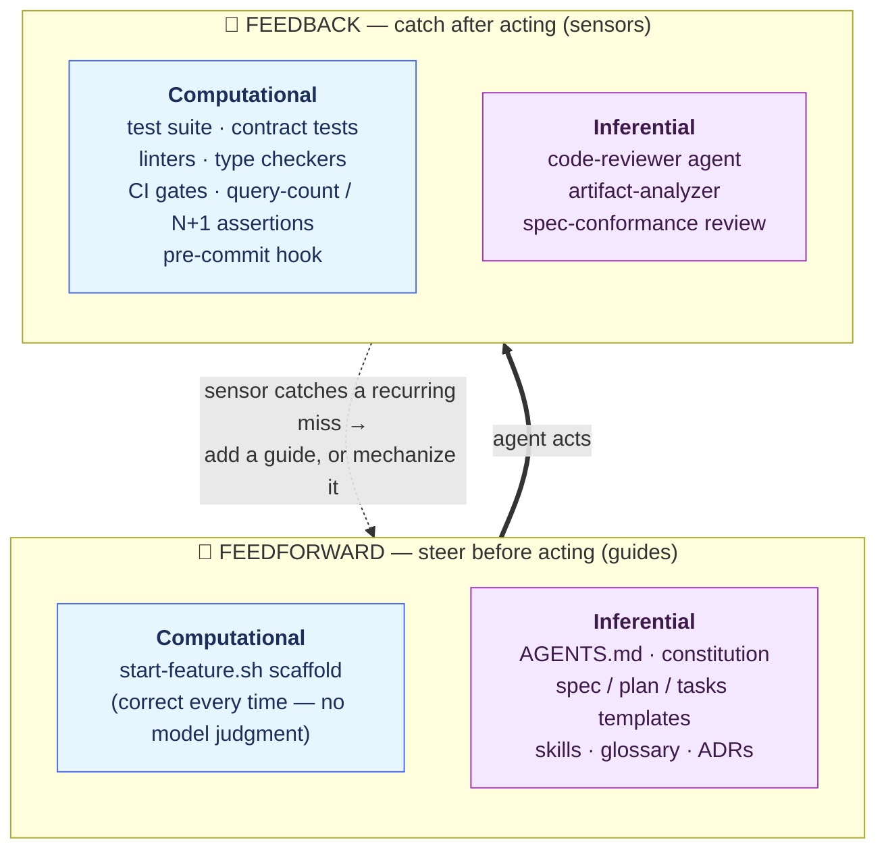
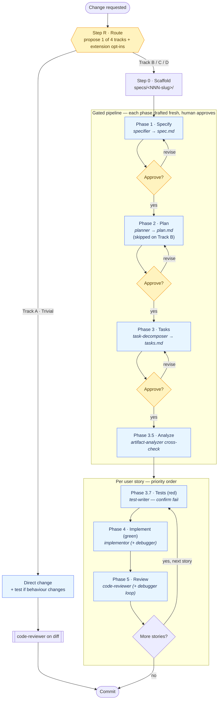
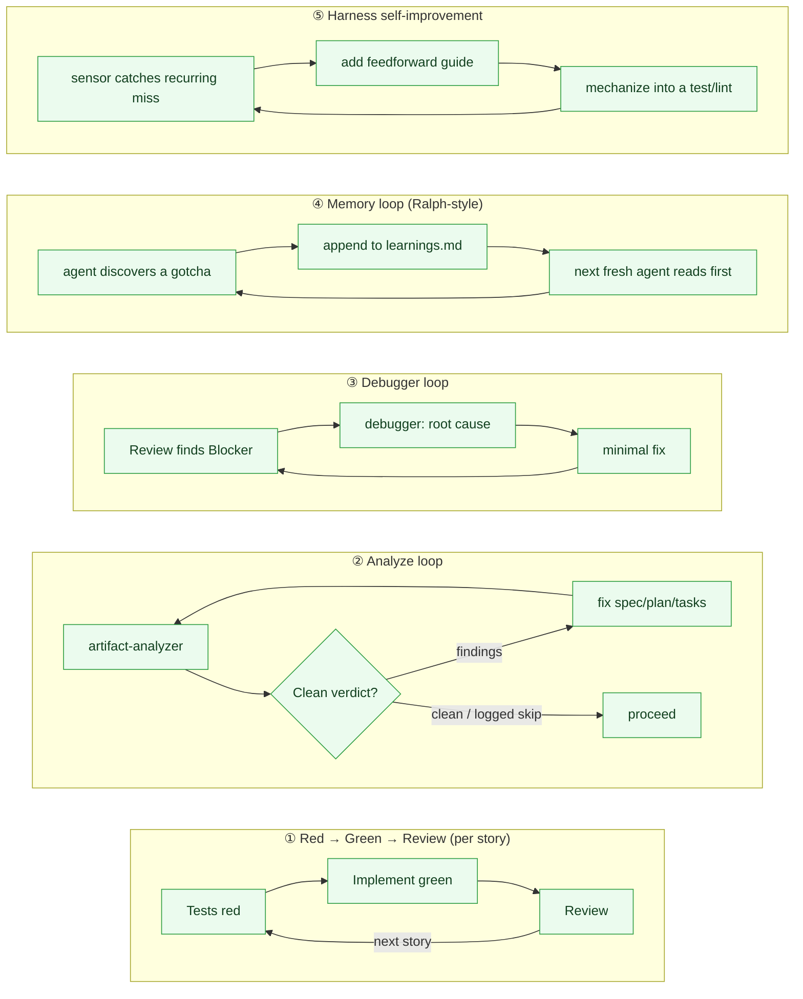

<div align="center">

# Spec-Driven Development Kit

**A portable harness that turns a coding agent into a disciplined engineer — one that specs before it builds, tests before it codes, and never self-approves its own work.**

[](docs/harness-engineering.md)
[](.agents/agents)
[](.agents/skills)
[](scripts)
[](CHANGELOG.md)
[](LICENSE)

</div>

---

<b>Contents</b> · [What it is](#what-it-is) · [Why it's useful](#why-its-useful) · [How to use it](#how-to-use-it) · [Agents](#the-agents) · [Skills](#the-skills) · [Harness engineering](#harness-engineering-mapped) · [SDLC workflow](#the-sdlc-workflow-as-implemented) · [Loops](#the-loops) · [Repository map](#repository-map) · [Feature list](#complete-feature-list) · [Further reading](#further-reading)

---

## What it is

This repo is a **harness** — a set of feedforward guides and feedback sensors wrapped around an AI coding agent so its output can be trusted without reading every line by hand. Instead of asking an agent to "build feature X" in one shot, it routes the work through gated phases (**Specify → Plan → Tasks → Analyze → Tests → Implement → Review**), each drafted by a dedicated single-purpose agent in its own fresh context, each requiring **human sign-off** before the next begins.

Everything an agent needs — conventions, principles, templates, workflows — lives in version-controlled Markdown at the project root, tiered by how often it's read so the always-loaded context stays small. One canonical source (`.agents/`) is mirrored into tool-specific formats for **Claude Code, GitHub Copilot, and Codex**, so the same discipline follows you across tools.

## Why it's useful

- **Catches mistakes where they're cheapest.** A wrong spec caught at a gate costs a re-draft; the same error caught after implementation costs the whole feature.
- **Right-sizes ceremony to the work.** A typo doesn't get a problem statement and a constitution review; a new service gets research, a data model, and an ADR. Depth is a decision the agent *proposes* and the human *approves* — not a constant.
- **Earns every token.** Deep reference docs are pulled in by name only when relevant, not inlined into every call. Sensors report pass/fail plus the first error, not 500 log lines.
- **Mechanize what you can, infer what you must.** Deterministic checks (hooks, tests, linters) do the cheap, repeatable work; LLM judgment is reserved for what no linter can check.
- **Portable & tool-agnostic.** One kit, mirrored across three agent toolchains from a single source of truth.

---

## How to use it

```bash
# 1. Clone / copy this kit into your project
git clone <this-repo> && cd spec-driven-development

# 2. Enable the deterministic pre-commit sensor (once per clone)
git config core.hooksPath .githooks

# 3. Bootstrap your project's agent config from the actual codebase
#    → run the `init-project` skill (produces AGENTS.md + memory/constitution.md)

# 4. Start any change through the workflow
#    → run the `develop-feature` skill: "start a new feature: <X>"
#    It proposes a right-sized track, then gates you through each phase.
```

The two entry points are **`init-project`** (one-time setup) and **`develop-feature`** (every change after that). Everything else is invoked by those two or on demand. After editing any canonical agent or skill under `.agents/`, run `scripts/mirror-agents.sh` / `scripts/mirror-skills.sh` (`.ps1` twins included) to propagate to the per-tool directories.

Already have a copy from an earlier kit version? See **[Repository map](#repository-map)** below for `scripts/update-kit.sh` — it pulls kit-owned improvements into your existing copy without touching `AGENTS.md`, the constitution, `specs/`, or your stack-specific hook/CI sections.

> **Single source of truth:** edit only files under `.agents/`, `templates/`, `docs/`, and `memory/`. Never hand-edit generated files in `.claude/`, `.github/`, or `.codex/` — the mirror scripts overwrite them ([ADR-0001](docs/adr/0001-agents-md-single-source-of-truth.md)).

---

## The agents

Nine single-purpose agents, each invoked **fresh** so one phase's back-and-forth never bleeds into the next, and each pinnable to the model tier its phase actually needs. Canonical definitions live in [`.agents/agents/`](.agents/agents).

| Agent | Role | Purpose |
|---|---|---|
| **specifier** | Specify (Phase 1) | Drafts `spec.md` — the **WHAT & WHY** only, never tech stack or code structure. |
| **planner** | Plan (Phase 2) | Drafts `plan.md` — the **HOW**, never contradicting the spec; runs the constitution-check gates. |
| **task-decomposer** | Tasks (Phase 3) | Mechanically breaks the approved plan into an ordered, tests-first task list — never invents scope. |
| **artifact-analyzer** | Analyze (Phase 3.5) | Read-only consistency & coverage cross-check across spec + plan + tasks. Reports; never edits. |
| **test-writer** | Tests / red (Phase 3.7) | Writes failing tests **first**, confirms they fail for the right reason, and stops at red. |
| **implementor** | Implement / green (Phase 4) | Writes the smallest code that turns red tests green — never writes, weakens, or deletes a test. |
| **debugger** | Escalation | Investigates a failure and returns **root cause + minimal fix**, not a rewrite. |
| **code-reviewer** | Review (Phase 5) | Judges what a linter can't: spec/constitution conformance, naming, abstraction creep, test integrity, security. |
| **docs-writer** | Docs sync | Keeps README / AGENTS.md / glossary / ADRs truthful — edits docs only, never application code. |

## The skills

Seven workflow skills — the verbs a human (or orchestrator) invokes. Canonical definitions in [`.agents/skills/`](.agents/skills).

| Skill | Purpose |
|---|---|
| **develop-feature** | The main orchestrator. Proposes a right-sized track, scaffolds the feature folder, and drives Specify → Plan → Tasks → Analyze → Tests → Implement → Review, owning every approval gate. |
| **init-project** | One-time setup. Reads the codebase and produces a filled-in `AGENTS.md` + `memory/constitution.md` with explicit approval before writing. |
| **check-spec** | Generates a requirements-quality checklist for a spec — is it complete, clear, consistent, measurable? ("unit tests for the spec"). |
| **clarify-spec** | Surfaces and resolves ambiguity in a draft spec, asking targeted questions one at a time and writing answers back into `spec.md`. |
| **amend-constitution** | Safely amends `memory/constitution.md` — targeted questions, explicit approval before saving. |
| **create-adr** | Records an Architecture Decision Record: finds the next number, fills the template, writes `docs/adr/<NNNN-slug>.md`. |
| **sync-agents-md** | Re-syncs `AGENTS.md` from repo evidence after the project has drifted, with approval before writing. |

---

## Harness engineering, mapped

The kit's core mental model: every control is either a **feedforward guide** (steers before acting) or a **feedback sensor** (catches after acting), and each is either **computational** (deterministic, zero-token, never hallucinates) or **inferential** (LLM judgment, costs tokens, reserved for what computation can't reach). The design rule is **mechanize what you can, infer what you must** — full detail in [`docs/harness-engineering.md`](docs/harness-engineering.md).


```mermaid
flowchart TB
    subgraph FF["🧭 FEEDFORWARD — steer before acting (guides)"]
        direction TB
        FFC["<b>Computational</b><br/>start-feature.sh scaffold<br/>(correct every time — no model judgment)"]
        FFI["<b>Inferential</b><br/>AGENTS.md · constitution<br/>spec / plan / tasks templates<br/>skills · glossary · ADRs"]
    end
    subgraph FB["📡 FEEDBACK — catch after acting (sensors)"]
        direction TB
        FBC["<b>Computational</b><br/>test suite · contract tests<br/>linters · type checkers<br/>CI gates · query-count / N+1 assertions<br/>pre-commit hook"]
        FBI["<b>Inferential</b><br/>code-reviewer agent<br/>artifact-analyzer<br/>spec-conformance review"]
    end
    FF ==>|"agent acts"| FB
    FB -.->|"sensor catches a recurring miss →<br/>add a guide, or mechanize it"| FF

    classDef comp fill:#e7f5ff,stroke:#4c6ef5,color:#1c2f5a;
    classDef inf fill:#f3e8ff,stroke:#9c36b5,color:#3d1a4a;
    class FFC,FBC comp;
    class FFI,FBI inf;
```

The two halves must both be present: **feedback-only** repeats the same mistakes forever; **feedforward-only** encodes rules but never verifies them. A working harness closes the loop — when a sensor catches a recurring miss, you add a guide (or, better, mechanize it).

---

## The SDLC workflow, as implemented

`develop-feature` first **routes** the work to one of four tracks (right-sizing depth), then runs the gated pipeline. Every gate is a human-in-the-loop checkpoint; the per-story block (Tests → Implement → Review) repeats for each user story in priority order.


```mermaid
flowchart TD
    START([Change requested]) --> R{{"Step R · Route<br/>propose 1 of 4 tracks + extension opt-ins"}}

    R -->|"Track A · Trivial"| A["Direct change<br/>+ test if behaviour changes"]
    A --> ARV[["code-reviewer on diff"]]
    ARV --> DONE([Commit])

    R -->|"Track B / C / D"| S0["Step 0 · Scaffold<br/>specs/&lt;NNN-slug&gt;/"]
    S0 --> P1

    subgraph GATED["Gated pipeline — each phase drafted fresh, human approves"]
        direction TB
        P1["Phase 1 · Specify<br/><i>specifier → spec.md</i>"] --> G1{Approve?}
        G1 -->|revise| P1
        G1 -->|yes| P2["Phase 2 · Plan<br/><i>planner → plan.md</i><br/>(skipped on Track B)"]
        P2 --> G2{Approve?}
        G2 -->|revise| P2
        G2 -->|yes| P3["Phase 3 · Tasks<br/><i>task-decomposer → tasks.md</i>"]
        P3 --> G3{Approve?}
        G3 -->|revise| P3
        G3 -->|yes| P35["Phase 3.5 · Analyze<br/><i>artifact-analyzer cross-check</i>"]
    end

    P35 --> LOOP

    subgraph LOOP["Per user story — priority order"]
        direction TB
        T["Phase 3.7 · Tests (red)<br/><i>test-writer — confirm fail</i>"] --> I["Phase 4 · Implement (green)<br/><i>implementor (+ debugger)</i>"]
        I --> RV["Phase 5 · Review<br/><i>code-reviewer (+ debugger loop)</i>"]
        RV --> MORE{More stories?}
        MORE -->|yes, next story| T
    end

    MORE -->|no| DONE

    classDef gate fill:#fff3bf,stroke:#f08c00,color:#5c3c00;
    classDef phase fill:#e7f5ff,stroke:#4c6ef5,color:#1c2f5a;
    class G1,G2,G3,R gate;
    class P1,P2,P3,P35,T,I,RV,A phase;
```

**The four tracks** (breadth/depth elasticity, adapted from AWS AI-DLC — see [ADR-0002](docs/adr/0002-adaptive-workflow-and-extensions.md)):

| Track | Use when | Artifacts |
|---|---|---|
| **A · Trivial** | Typo, config value, dep bump, obvious one-liner | None — rationale in commit message |
| **B · Simple** | Localized bug fix / small enhancement | Short `spec.md` + `tasks.md` (no `plan.md`) |
| **C · Moderate** *(default)* | A normal new capability | Full `spec.md` + `plan.md` + `tasks.md` |
| **D · Complex** | New service, cross-cutting, or untested legacy | Full pipeline + `research.md`/`data-model.md` + ADR + characterization tests first |

---

## The loops

Five feedback loops keep the harness self-correcting rather than one-shot.


```mermaid
flowchart LR
    subgraph L1["① Red → Green → Review (per story)"]
        direction LR
        a1[Tests red] --> a2[Implement green] --> a3[Review] -->|next story| a1
    end
    subgraph L2["② Analyze loop"]
        direction LR
        b1[artifact-analyzer] --> b2{Clean verdict?}
        b2 -->|findings| b3[fix spec/plan/tasks] --> b1
        b2 -->|clean / logged skip| b4[proceed]
    end
    subgraph L3["③ Debugger loop"]
        direction LR
        c1[Review finds Blocker] --> c2[debugger: root cause] --> c3[minimal fix] --> c1
    end
    subgraph L4["④ Memory loop (Ralph-style)"]
        direction LR
        d1[agent discovers a gotcha] --> d2[append to learnings.md] --> d3[next fresh agent reads first] --> d1
    end
    subgraph L5["⑤ Harness self-improvement"]
        direction LR
        e1[sensor catches recurring miss] --> e2[add feedforward guide] --> e3[mechanize into a test/lint] --> e1
    end

    classDef loop fill:#ebfbee,stroke:#2f9e44,color:#12401f;
    class a1,a2,a3,b1,b2,b3,b4,c1,c2,c3,d1,d2,d3,e1,e2,e3 loop;
```

1. **Red → Green → Review** — the TDD core, repeated per user story until the last one clears review.
2. **Analyze loop** — the cross-check loops until a clean verdict or a logged skip before implementation ([ADR-0004](docs/adr/0004-analyze-loops-to-clean-verdict.md)).
3. **Debugger loop** — review Blockers hand off to `debugger` for root cause + minimal fix, then re-review.
4. **Memory loop** — `learnings.md` is an append-only, ungated scratchpad that survives fresh-context restarts, modeled on the "Ralph Wiggum" agentic loop; periodically compacted with human approval ([ADR-0005](docs/adr/0005-ralph-loop-agent-memory.md), [ADR-0006](docs/adr/0006-learnings-compaction.md)).
5. **Harness self-improvement** — every recurring miss becomes a guide, then a mechanized control. The standing rule that keeps the harness tightening over time.

---

## Repository map

```
.agents/            ← CANONICAL source (edit here)
  agents/           9 single-purpose agent definitions
  skills/           7 workflow skills
  extensions/       opt-in rule packs (e.g. security/baseline)
.claude/ .codex/ .github/   ← GENERATED mirrors (never hand-edit)
docs/               deep-reference guides + adr/ (Architecture Decision Records)
memory/             constitution.md — highest-authority feedforward guide
templates/          spec / plan / tasks / decision-log / learnings / … templates
scripts/            mirror-agents · mirror-skills · quiet (log backpressure)
specs/              per-feature folders (spec, plan, tasks, decision-log, learnings)
tests/              unit · integration · contract · characterization
.githooks/          pre-commit — deterministic, zero-token sensor
.github/workflows/  agent-harness.yml — CI backstop sensor
AGENTS.md           always-loaded operational conventions (single source of truth)
VERSION             installed kit version (semver)
CHANGELOG.md        the kit's own release history
```

> **Updating an existing copy:** `docs/KIT-MANIFEST.md` is the explicit
> manifest of which paths above are kit-owned vs. project-owned
> ([ADR-0007](docs/adr/0007-kit-versioning-and-update-path.md)). Point
> `scripts/update-kit.sh` (`.ps1` twin) at a newer kit checkout to pull in
> kit-owned changes — new agent/skill fixes, template updates, hardened
> hook/CI checks — without touching `AGENTS.md`, `memory/`, `specs/`, or your
> stack-specific hook/CI sections:
> ```bash
> git clone <this-repo> /tmp/sdd-kit && scripts/update-kit.sh /tmp/sdd-kit --dry-run
> scripts/update-kit.sh /tmp/sdd-kit   # apply, then review the diff and commit
> ```

---

## Complete feature list

**Workflow & orchestration**

- **Gated SDD pipeline** — Specify → Plan → Tasks → Analyze → Tests → Implement → Review, each phase human-approved before the next.
- **Fresh-context agents** — every phase runs a dedicated agent in isolation so revision back-and-forth never leaks between phases.
- **Four adaptive workflow tracks** — Trivial / Simple / Moderate / Complex, right-sizing ceremony to the change.
- **Route step** — the agent proposes exactly one track + rationale + artifact list; the human confirms or overrides.
- **Track promotion** — B→C when a design decision surfaces mid-work, logged.
- **Analyze gate** — non-destructive spec ↔ plan ↔ tasks cross-check whose depth scales with the track.
- **Per-story red-green-review loop** — TDD enforced per user story in priority order.
- **Resume-in-place** — a `Status` header (`Draft` / `Approved`) on each document is the resume signal; work picks up at the first un-approved doc.
- **Approval gates as human-in-the-loop sensors** — placed where a mistake is cheapest to catch.

**Agents (9)** — specifier, planner, task-decomposer, artifact-analyzer, test-writer, implementor, debugger, code-reviewer, docs-writer (see table above).

**Skills (7)** — develop-feature, init-project, check-spec, clarify-spec, amend-constitution, create-adr, sync-agents-md (see table above).

**Context & token engineering**

- **Tiered instructions** — guidance sorted by read-frequency so always-loaded context stays small.
- **By-name doc references** — deep docs pulled in only when relevant, never inlined into every call.
- **Model routing** — each phase pinned to the right model tier for its cost/quality trade-off.
- **Efficient-code guidance** — explicit rules against per-row loops, N+1 queries, and other slow defaults.
- **quiet.sh / quiet.ps1** — context-efficient backpressure: pass/fail + first error to the agent, full log to a file.

**Harness & sensors**

- **Feedforward/feedback × computational/inferential** control model, explicitly mapped to repo files.
- **pre-commit hook** — deterministic, zero-token checks (secret-blocking, etc.); `.sh` + `.ps1`.
- **CI workflow** (`agent-harness.yml`) — language-agnostic backstop that fires even when the local sensor is skipped.
- **code-reviewer** — inferential backstop for spec conformance, abstraction creep, test integrity.
- **Test scaffolding** — unit / integration / contract / characterization test directories.
- **Characterization-tests-first** — behaviour sensor for untested legacy code (Track D, ask-first).

**Governance & memory**

- **Constitution** (`memory/constitution.md`) — highest-authority, always-on principles; test-first is non-negotiable.
- **Architecture Decision Records** (`docs/adr/`) — seven shipped ADRs documenting the kit's own design.
- **Per-feature decision log** — committed audit trail of track, extension opt-ins, and each gate approval.
- **learnings.md** — append-only cross-session agent memory (Ralph-style), with human-gated compaction.
- **Test-intent docstrings** — every test explains *why* it exists, so a future run can tell "test is wrong" from "code regressed."
- **Search-before-create** rule — stops bad ripgrep conclusions from producing duplicate implementations.

**Extensibility & portability**

- **Single source of truth** — canonical `.agents/` mirrored into Claude, Copilot, and Codex formats ([ADR-0001](docs/adr/0001-agents-md-single-source-of-truth.md)).
- **Mirror scripts** — `mirror-agents` (generates per-tool formats) + `mirror-skills` (byte-for-byte copy); CI fails if mirrors drift.
- **Opt-in extension packs** — blocking rule packs (e.g. `security/baseline`) layered onto a feature on demand, loaded only when opted in.
- **Kit versioning + update path** — `VERSION` + `CHANGELOG.md`, an explicit kit-owned/project-owned manifest (`docs/KIT-MANIFEST.md`), and `scripts/update-kit.sh` to pull upstream kit improvements into an existing copy without a manual three-way merge ([ADR-0007](docs/adr/0007-kit-versioning-and-update-path.md)).
- **Templates** — canonical spec / plan / tasks / research / data-model / decision-log / learnings / constitution / checklist / quickstart / agents templates.
- **MCP guidance** (`docs/mcp.md` + `.mcp.json.example`) — which servers to connect, the 5–7 cap, and security.
- **Path-scoped instructions** — per-directory guidance (`.github/instructions/`).
- **Glossary** — domain vocabulary referenced from AGENTS.md's Domain Language section.

---

## Further reading

| Doc | Covers |
|---|---|
| [`docs/harness-engineering.md`](docs/harness-engineering.md) | Guides vs. sensors; computational vs. inferential controls. |
| [`docs/context-engineering.md`](docs/context-engineering.md) | What the agent sees on every call; tiering, context rot, compaction. |
| [`docs/adaptive-workflow-and-extensions.md`](docs/adaptive-workflow-and-extensions.md) | The four tracks and opt-in extension mechanism. |
| [`docs/model-selection-and-token-optimization-in-sdd.md`](docs/model-selection-and-token-optimization-in-sdd.md) | Routing each phase to the right model. |
| [`docs/token-efficiency.md`](docs/token-efficiency.md) | Most correct work per token. |
| [`docs/hooks.md`](docs/hooks.md) · [`docs/mcp.md`](docs/mcp.md) · [`docs/guardrails.md`](docs/guardrails.md) | Hooks, MCP, and universal guardrails. |
| [`docs/adr/`](docs/adr) | The six Architecture Decision Records behind this kit's design. |

<div align="center">
<sub>Adapted from Fowler & Boeckeler's <b>harness engineering</b>, AWS Labs' <b>AI-DLC</b> adaptive workflows, and Huntley's <b>Ralph Wiggum</b> loop pattern. See each doc's References section.</sub>
</div>
