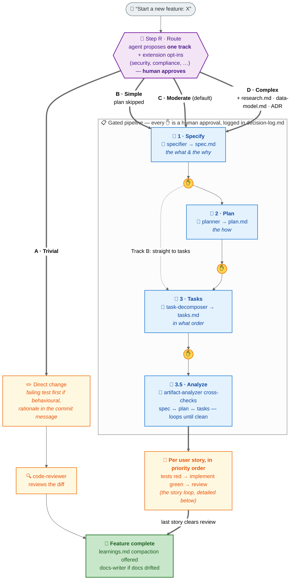
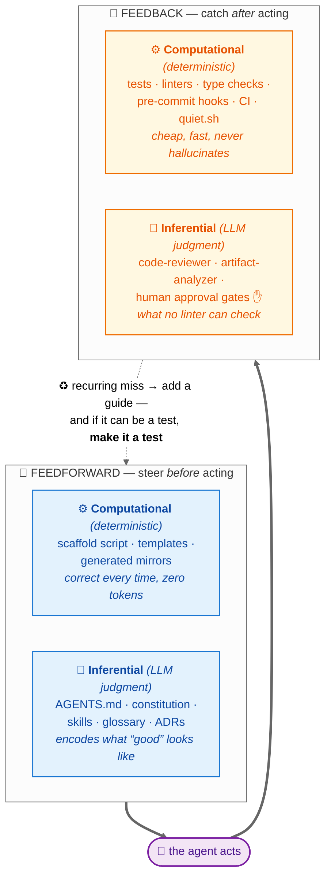
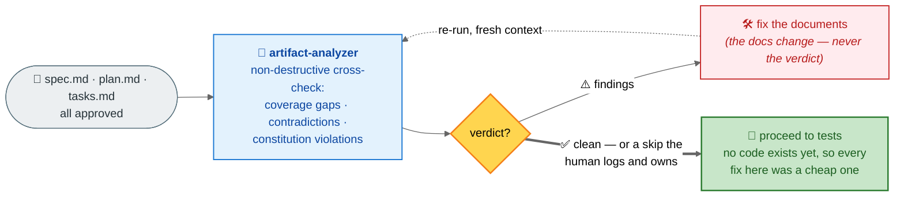
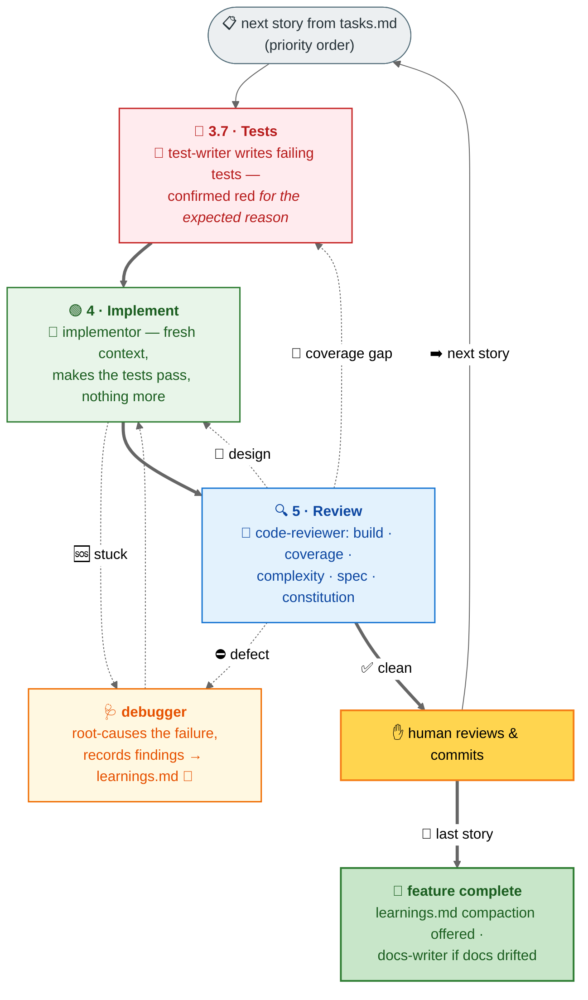

<div align="center">

# 🧭 Spec-Driven Development Kit

**A portable harness that turns AI coding agents into a disciplined engineering team.**

Drop it into any repository. Get a gated Specify → Plan → Tasks → Implement pipeline,
nine focused agents, deterministic guardrails — and a clean upgrade path for all of it.

<!-- Keep the version badge in sync with KIT_VERSION when releasing. -->
[](KIT-CHANGELOG.md)
[](LICENSE)
[](#-works-with-your-tools)
[](#-works-with-your-tools)
[](#-works-with-your-tools)
[](scripts/)

[Why this kit](#-why-this-kit) · [The workflow](#-the-workflow) · [What a run looks like](#-what-a-run-looks-like) · [Quick start](#-add-it-to-an-existing-project) · [The skills](#-the-skills) · [Upgrading](#-upgrading) · [Best practices](#-getting-the-best-out-of-it)

</div>

---

## 💡 Why this kit

Prompting an agent to "just build the feature" produces code you have to re-read line by line.
This kit replaces that with a pipeline where every expensive mistake is caught while it's still
a cheap one: a wrong spec costs a re-draft at an approval gate, not a rewritten feature.

Three things set it apart:

- **Versioned and upgradeable.** A machine-enforced ownership contract defines exactly which
  files the kit may update and which are forever yours — so adopting it never means forking it.
- **One source, every tool.** Agents and skills are defined once and mirrored byte-for-byte to
  Claude Code, GitHub Copilot, and Codex. Your team's tool choice stops mattering.
- **Token-disciplined by architecture.** Thin pointer files, phase protocols read at the point
  of use, fresh sub-agent contexts per phase — context engineering is the design, not a tip.

## ✨ Key features

| Feature | What you get |
|---|---|
| **Gated SDLC pipeline** | Route → Specify → Plan → Tasks → Analyze → Tests (red) → Implement (green) → Review. Human sign-off at every gate, recorded in a committed `decision-log.md`. |
| **Right-sized rigor** | Four workflow tracks — a typo fix doesn't get user stories; a new service doesn't get CRUD-level ceremony. The agent proposes, you decide. |
| **Nine focused agents** | `specifier` · `planner` · `task-decomposer` · `artifact-analyzer` · `test-writer` · `implementor` · `debugger` · `code-reviewer` · `docs-writer` — each runs fresh, in its own context, on the model tier its phase needs. |
| **Single source of truth** | Canonical definitions in `.agents/`; generated mirrors for each tool. CI fails if a mirror drifts. |
| **Contractual upgrades** | `scripts/update-kit.sh`: copy kit updates in without ever touching your code, specs, or config. |
| **Opt-in extension packs** | Blocking rule packs (security, compliance, …) layered onto a feature only when you say so. |
| **Project memory** | A constitution of always-true principles, a per-feature decision log, and a `learnings.md` that captures what went sideways — with compaction so it never bloats. |
| **Cross-platform** | Every script ships as a `.sh` / `.ps1` twin. |

## 🧱 Principles

1. **Every token must earn its place.** Small always-loaded files; deep reference docs pulled in by name only when needed.
2. **Mechanize what you can, infer what you must.** A rule that can be a test should be a test, not a sentence an agent re-reads.
3. **Humans decide where mistakes are cheap.** Gates sit at spec, plan, and tasks — the points where course-correcting costs a paragraph, not a feature.
4. **Test-first, non-negotiable.** Red before green; regression guards for bug fixes; characterization tests before touching untested legacy code.
5. **Depth is a decision, not a constant.** Rigor scales with the work, and the routing itself is logged and auditable.
6. **No over-engineering.** Only what is directly requested — enforced as a guardrail in every skill session.

## 🗺️ The workflow

One skill — `develop-feature` — drives everything. It first **routes** the work to a
right-sized track, then walks the gated pipeline, delegating each document to a dedicated agent.

The four tracks:

| Track | Typical work | What's produced |
|---|---|---|
| **A · Trivial** | Typo, comment, config value, dependency bump — no design choices | No feature folder. Failing test first if behavior changes, then the change; `code-reviewer` on the diff; rationale in the commit message |
| **B · Simple** | Localized bug fix or small enhancement, no new architecture | Short `spec.md` (problem, acceptance, regression guards) + `tasks.md`; `plan.md` skipped unless a design decision surfaces |
| **C · Moderate** *(default)* | A normal new capability | Full `spec.md` → `plan.md` → `tasks.md` at standard depth |
| **D · Complex** | New service, cross-cutting change, untested legacy code | Full pipeline at maximum depth, plus `research.md` / `data-model.md` as needed, an ADR for the cross-cutting decision, and characterization tests offered before touching legacy code |


```mermaid
%%{init: {'theme': 'neutral'}}%%
flowchart TD
    START(["💬 “Start a new feature: X”"]) --> R

    R{{"🚦 Step R · Route<br/>agent proposes <b>one track</b> + extension opt-ins<br/>(security, compliance, …) — <b>human approves</b>"}}

    R ==>|"<b>A · Trivial</b>"| TA
    R ==>|"<b>B · Simple</b><br/>plan skipped"| SP
    R ==>|"<b>C · Moderate</b> (default)"| SP
    R ==>|"<b>D · Complex</b><br/>+ research.md · data-model.md · ADR"| SP

    TA["✏️ Direct change<br/><i>failing test first if behavioural,<br/>rationale in the commit message</i>"] --> RVA["🔍 code-reviewer<br/>reviews the diff"]
    RVA --> DONE

    subgraph GATED["&nbsp;📋 Gated pipeline — every ✋ is a human approval, logged in decision-log.md&nbsp;"]
        direction TB
        SP["📝 <b>1 · Specify</b><br/>🤖 specifier → spec.md<br/><i>the what & the why</i>"] --> G1(("✋"))
        G1 --> PL["📐 <b>2 · Plan</b><br/>🤖 planner → plan.md<br/><i>the how</i>"]
        G1 -.->|"Track B: straight to tasks"| TK
        PL --> G2(("✋")) --> TK["🧩 <b>3 · Tasks</b><br/>🤖 task-decomposer → tasks.md<br/><i>in what order</i>"]
        TK --> G3(("✋")) --> AN["🔎 <b>3.5 · Analyze</b><br/>🤖 artifact-analyzer cross-checks<br/>spec ↔ plan ↔ tasks — loops until clean"]
    end

    AN ==> LOOP["🔁 <b>Per user story, in priority order</b><br/>tests red → implement green → review<br/><i>(the story loop, detailed below)</i>"]

    LOOP ==>|"last story clears review"| DONE["🏁 <b>Feature complete</b><br/>learnings.md compaction offered<br/>docs-writer if docs drifted"]

    classDef routing fill:#f3e5f5,stroke:#7b1fa2,stroke-width:2px,color:#4a148c
    classDef phase fill:#e3f2fd,stroke:#1976d2,stroke-width:1.5px,color:#0d47a1
    classDef gate fill:#ffd54f,stroke:#f57f17,stroke-width:2px,color:#000
    classDef story fill:#fff8e1,stroke:#ef6c00,stroke-width:1.5px,color:#e65100
    classDef done fill:#c8e6c9,stroke:#2e7d32,stroke-width:2px,color:#1b5e20
    classDef entry fill:#eceff1,stroke:#546e7a,color:#263238

    class R routing
    class SP,PL,TK,AN phase
    class G1,G2,G3 gate
    class TA,RVA,LOOP story
    class DONE done
    class START entry
```

> [!NOTE]
> The decimal phases (3.5 Analyze, 3.7 Tests) slot between Tasks and Implement in the classic
> Specify → Plan → Tasks → Implement numbering — added checks, not renumbered phases.
> Every approval flips the document's `Status` to `Approved` and appends a `decision-log.md`
> row — which is also how a feature spanning days of separate sessions **resumes exactly where
> it left off**, with no scratch files.

## 🔬 What a run looks like

A Track C feature, condensed:

```text
You:    Start a new feature: rate-limit the login endpoint.

Agent:  Step R — I propose Track C (Moderate): a new capability, no
        architectural change. Artifacts: spec.md, plan.md, tasks.md.
        Opt-in extension available: security/baseline — include it?

You:    Approved, include security/baseline.        ✋ logged

Agent:  [specifier drafts spec.md — user stories, acceptance criteria,
        one [NEEDS CLARIFICATION]: lockout duration?]

You:    15 minutes. Approved.                        ✋ logged
        …plan ✋ … tasks ✋ … analyze ✅ … then per story:
        tests red → implement green → review → you commit.
```

After the run, the feature folder is the complete record:

```text
specs/003-login-rate-limit/
├── spec.md            # what & why — user stories, acceptance criteria
├── plan.md            # how — approach, interfaces, risks
├── tasks.md           # in what order — tasks grouped per user story
├── decision-log.md    # one row per gate: who approved what, when
├── learnings.md       # what went sideways, feeding the next feature
└── contracts/         # API contracts, when the plan calls for them
```

Close the session mid-feature and ask to continue later — Step R detects the folder,
reads the decision log, and resumes at the exact phase it left off.

## 🛡️ The harness

Spec-driven development *is* a harness: **feedforward guides** steer the agent before it acts,
**feedback sensors** catch it after — and the loop between them is where the harness improves.


```mermaid
%%{init: {'theme': 'neutral'}}%%
flowchart TD
    subgraph FF["&nbsp;🧭 FEEDFORWARD — steer <i>before</i> acting&nbsp;"]
        direction LR
        FFC["⚙️ <b>Computational</b> <i>(deterministic)</i><br/>scaffold script · templates ·<br/>generated mirrors<br/><i>correct every time, zero tokens</i>"]
        FFI["🧠 <b>Inferential</b> <i>(LLM judgment)</i><br/>AGENTS.md · constitution ·<br/>skills · glossary · ADRs<br/><i>encodes what “good” looks like</i>"]
    end

    AGENT(["🤖 the agent acts"])

    subgraph FB["&nbsp;📡 FEEDBACK — catch <i>after</i> acting&nbsp;"]
        direction LR
        FBC["⚙️ <b>Computational</b> <i>(deterministic)</i><br/>tests · linters · type checks ·<br/>pre-commit hooks · CI · quiet.sh<br/><i>cheap, fast, never hallucinates</i>"]
        FBI["🧠 <b>Inferential</b> <i>(LLM judgment)</i><br/>code-reviewer · artifact-analyzer ·<br/>human approval gates ✋<br/><i>what no linter can check</i>"]
    end

    FF ==> AGENT ==> FB
    FB -.->|"♻️ recurring miss → add a guide —<br/>and if it can be a test, <b>make it a test</b>"| FF

    classDef guide fill:#e3f2fd,stroke:#1976d2,stroke-width:1.5px,color:#0d47a1
    classDef sensor fill:#fff8e1,stroke:#ef6c00,stroke-width:1.5px,color:#e65100
    classDef actor fill:#f3e5f5,stroke:#7b1fa2,stroke-width:2px,color:#4a148c
    class FFC,FFI guide
    class FBC,FBI sensor
    class AGENT actor
```

The feedforward half ships filled-in. The feedback half is deliberately yours to wire to your
stack: start with a test command and a linter, then a CI job mirroring them. `scripts/quiet.sh`
keeps their output token-cheap — pass/fail plus first error to the agent, full log to a file.

The dotted arrow is the meta-loop, and it's run by you: when a sensor catches the same mistake
twice, mechanize it — a test or lint rule if possible, an `AGENTS.md` line if not. Each
iteration makes the next diff more trustable without reading every line yourself.
[docs/guardrails.md](docs/guardrails.md) covers this in depth.

## 🔁 The loops

**Analyze loop** *(Phase 3.5)* — the artifacts must agree before any code exists:


```mermaid
%%{init: {'theme': 'neutral'}}%%
flowchart LR
    IN(["📄 spec.md · plan.md · tasks.md<br/>all approved"]) --> AZ

    AZ["🔎 <b>artifact-analyzer</b><br/>non-destructive cross-check:<br/>coverage gaps · contradictions ·<br/>constitution violations"] --> V{"verdict?"}
    V -->|"⚠️ findings"| FX["🛠️ fix the documents<br/><i>(the docs change — never the verdict)</i>"]
    FX -.->|"re-run, fresh context"| AZ
    V ==>|"✅ clean — or a skip the<br/>human logs and owns"| GO["🧪 proceed to tests<br/>no code exists yet, so every<br/>fix here was a cheap one"]

    classDef input fill:#eceff1,stroke:#546e7a,color:#263238
    classDef check fill:#e3f2fd,stroke:#1976d2,stroke-width:1.5px,color:#0d47a1
    classDef verdict fill:#ffd54f,stroke:#f57f17,stroke-width:2px,color:#000
    classDef fix fill:#ffebee,stroke:#c62828,stroke-width:1.5px,color:#b71c1c
    classDef ok fill:#c8e6c9,stroke:#2e7d32,stroke-width:2px,color:#1b5e20
    class IN input
    class AZ check
    class V verdict
    class FX fix
    class GO ok
```

**Story loop** *(Phases 3.7 → 4 → 5, repeated per user story in priority order)*:


```mermaid
%%{init: {'theme': 'neutral'}}%%
flowchart TD
    PICK(["📋 next story from tasks.md<br/>(priority order)"]) --> TW

    TW["🔴 <b>3.7 · Tests</b><br/>🤖 test-writer writes failing tests —<br/>confirmed red <i>for the expected reason</i>"] ==> IM
    IM["🟢 <b>4 · Implement</b><br/>🤖 implementor — fresh context,<br/>makes the tests pass, nothing more"]

    IM -.->|"🆘 stuck"| DB["🩺 <b>debugger</b><br/>root-causes the failure,<br/>records findings → learnings.md 🧠"]
    DB -.-> IM

    IM ==> RV["🔍 <b>5 · Review</b><br/>🤖 code-reviewer: build · coverage ·<br/>complexity · spec · constitution"]
    RV -.->|"⛔ defect"| DB
    RV -.->|"🎨 design"| IM
    RV -.->|"🧪 coverage gap"| TW
    RV ==>|"✅ clean"| CM["✋ human reviews & commits"]

    CM -->|"➡️ next story"| PICK
    CM ==>|"🏁 last story"| FIN["🎉 <b>feature complete</b><br/>learnings.md compaction offered ·<br/>docs-writer if docs drifted"]

    classDef red fill:#ffebee,stroke:#c62828,stroke-width:1.5px,color:#b71c1c
    classDef green fill:#e8f5e9,stroke:#2e7d32,stroke-width:1.5px,color:#1b5e20
    classDef review fill:#e3f2fd,stroke:#1976d2,stroke-width:1.5px,color:#0d47a1
    classDef debug fill:#fff8e1,stroke:#ef6c00,stroke-width:1.5px,color:#e65100
    classDef human fill:#ffd54f,stroke:#f57f17,stroke-width:2px,color:#000
    classDef done fill:#c8e6c9,stroke:#2e7d32,stroke-width:2px,color:#1b5e20
    classDef input fill:#eceff1,stroke:#546e7a,color:#263238

    class TW red
    class IM green
    class RV review
    class DB debug
    class CM human
    class FIN done
    class PICK input
```

## 🧰 The skills

Seven skills, defined once under `.agents/skills/` and mirrored to every tool:

| Skill | Use it to |
|---|---|
| `develop-feature` | Start **any** change, large or trivial — the front door to the whole pipeline. Routes, scaffolds, and owns every gate. |
| `init-project` | One-time setup: scan the codebase, then write a filled-in `AGENTS.md` and `memory/constitution.md` with your approval. |
| `clarify-spec` | Surface and resolve ambiguity in a draft spec before planning — targeted questions, answers written back into `spec.md`. |
| `check-spec` | Generate a requirements-quality checklist: "unit tests for the spec" — complete, clear, consistent, measurable? |
| `amend-constitution` | Change the always-true principles — gathered, then ratified, never skipped past you. |
| `create-adr` | Record an architecture decision as `docs/adr/<NNNN-slug>.md`. |
| `sync-agents-md` | Re-sync `AGENTS.md` against repo reality when it drifts. |

**Extension packs** are opt-in rule sets under `.agents/extensions/` (the kit ships
`security/baseline`; you can add your own). At Step R, `develop-feature` lists every available
pack and asks which to include; approved packs are recorded in the decision log and their rules
bind every downstream agent for that feature — and only that feature.

## 🚀 Add it to an existing project

You need `git`, `bash` (or PowerShell — every script has a `.ps1` twin), and one of the
supported agent tools.

**1 · Get a kit checkout**, anywhere on disk — it doesn't need to sit next to your project:

```bash
git clone https://github.com/<kit-org>/spec-driven-development /tmp/sdd-kit
```

**2 · Copy the kit-owned files in**, run from inside the kit checkout, pointing at your project:

```bash
cd /tmp/sdd-kit
scripts/update-kit.sh /path/to/your-project        # update-kit.ps1 on Windows
```

This copies exactly the kit-owned paths (`.agents/`, `templates/`, `scripts/`, reference docs,
generated tool mirrors) into your project — and nothing else. Your `src/`, `tests/`, CI, and
existing docs are untouched. Add `--dry-run` first to preview the file list. The kit itself
stays in `/tmp/sdd-kit`; you come back and re-run `update-kit.sh` whenever you want to pull in
kit changes.

**3 · Generate your project config.** In your agent tool, run the **`init-project`** skill. It
scans your codebase, then — with your approval at each gate — writes a filled-in `AGENTS.md` and
`memory/constitution.md`. Keep `CLAUDE.md` / `.github/copilot-instructions.md` as thin pointers
to `AGENTS.md`.

**4 · Optional sensors.** The kit's own pre-commit hook and CI workflow are *not* copied by
default (CI auto-runs on commit, which surprises projects with existing pipelines). Want them?
Copy `.githooks/pre-commit` and/or `.github/workflows/agent-harness.yml` from the kit checkout
by hand — they're yours from then on. For the hook: `git config core.hooksPath .githooks`.

**5 · Ship something.** Run the **`develop-feature`** skill on your first change. 🎉

## ⬆️ Upgrading

Same command, run again from the kit checkout — there's nothing to seed or bump in your project
first:

```bash
git -C /tmp/sdd-kit pull && git -C /tmp/sdd-kit checkout v0.2.0   # target release
cd /tmp/sdd-kit
scripts/update-kit.sh /path/to/your-project --dry-run             # preview
scripts/update-kit.sh /path/to/your-project                       # apply
```

> [!IMPORTANT]
> Only **kit-owned** paths are ever written. Project-owned paths — `AGENTS.md`, `memory/`,
> `specs/`, `src/`, `tests/`, your own ADRs — are never touched. `update-kit.sh` / `.ps1` read
> the kit-owned path list from `.agents/kit-manifest.conf` in the kit checkout at run time, so
> there's a single source of truth for what gets overwritten.

- Tool mirrors are **regenerated** in your project, not copied — your `model-map.conf` choices
  flow through.
- Unchanged files are skipped (content comparison), so a re-run only touches what actually
  changed — but there's no version tracking or downgrade guard: it always copies the kit-owned
  paths as they stand in whatever checkout you point it at, so double-check which tag/branch
  you've got checked out before running it.
- `KIT-CHANGELOG.md`, in the kit checkout, tells you what changed and why since your last update.

## 📦 Kit-owned files

These are the paths `scripts/update-kit.sh` (`.ps1` twin) copies into your project. They're
overwritten wholesale on every update — hand-editing one creates a fork-on-day-one problem, so if
you need a local variant, add it under `.agents/extensions/` instead. The authoritative,
machine-readable list lives in `.agents/kit-manifest.conf`, in the kit checkout; this table is the
human-readable summary of it.

| Path | What it is |
|---|---|
| `.agents/kit-manifest.conf` | The machine-readable kit-owned path list both updater scripts read at run time. |
| `.agents/agents/`, `.agents/skills/` | Canonical agent and skill definitions. |
| `.agents/extensions/` | Opt-in rule packs the kit ships (e.g. `security/baseline`); packs you author yourself are project-owned. |
| `.claude/`, `.github/agents/`, `.github/skills/`, `.codex/` | Generated mirrors of `.agents/`, regenerated by re-running `mirror-agents.sh` / `mirror-skills.sh` — never hand-edit these. |
| `scripts/mirror-agents.sh` / `.ps1`, `scripts/mirror-skills.sh` / `.ps1` | Mirror generators. |
| `scripts/quiet.sh` / `.ps1` | Log-condensing helper used by hooks/CI. |
| `templates/` | Spec/plan/tasks/checklist/etc. templates. |
| `docs/README.md`, `docs/guardrails.md` | Upstream reference guides. |
| `.mcp.json.example` | Example MCP config. |
| `.agents/LICENSE` | Kit license (Apache-2.0), scoped to the kit-owned paths. |

**Not distributed** — these live in this repo but stay in the kit checkout:

- `KIT_VERSION`, `KIT-CHANGELOG.md`, and `scripts/update-kit.sh` (`.ps1`) itself. The kit is
  never installed into your project as files; you run the updater from the checkout.
- `.githooks/pre-commit` (`.ps1`) and `.github/workflows/agent-harness.yml` — the kit's own
  reference sensors. A committed CI workflow auto-runs immediately, unlike an opt-in git hook,
  so both are copy-by-hand: bring either in if you want it, and it's yours to maintain from
  that point on.
- The kit's own `docs/adr/` (7 ADRs) — kit-maintainer design history, not something a
  downstream project's feature work depends on.
- `.gitattributes` — a repo-wide policy file that's yours, not the kit's: your copy may carry
  LFS rules, linguist overrides, or merge drivers the updater must not clobber. Copy-by-hand
  like the hooks above. At minimum, merge these two things into your own `.gitattributes`:
  `*.sh` / `*.bash` / `*.ps1 text eol=lf` (CRLF breaks shebangs on Unix shells), and the
  `linguist-generated` / `merge=ours` attributes on the generated mirror dirs (`.claude/**`,
  `.codex/**`, `.github/agents/**`, `.github/skills/**`). If an earlier kit version copied
  its `.gitattributes` over yours, restore your own rules from git history.
- The root `LICENSE` — your project's root LICENSE declares *your* license, and the updater
  must never overwrite it. The kit's Apache-2.0 text ships at `.agents/LICENSE` instead,
  covering the kit-owned paths. If an earlier kit version copied its LICENSE to your project
  root, review it and remove it by hand if it doesn't match your project's actual license.

**Project-owned** — the kit writes these once and `update-kit.sh` never touches them again:
`AGENTS.md`, `memory/`, `specs/`, `src/`, `tests/`, your own `docs/adr/`, `docs/glossary.md`,
`.mcp.json`, `CLAUDE.md` / `.github/copilot-instructions.md`, and anything else the kit didn't
ship. A new top-level file or directory you create is project-owned by default.

## 🏆 Getting the best out of it

- **Start every change through `develop-feature`** — even tiny ones. Track A exits in one step;
  the value is that *routing* is deliberate, not that every change gets a spec.
- **Take the gates seriously.** Rubber-stamping the spec gate is how you end up reviewing a whole
  wrong feature instead of one wrong paragraph. Unsure between two tracks? Take the heavier one —
  over-rigor is cheaper to trim than under-rigor is to recover.
- **Wire up your feedback half first.** The single highest-leverage move: put a fast test command
  (single-test form too) and a lint/type-check command in `AGENTS.md`, wrapped in
  `scripts/quiet.sh`. Agents self-correct against sensors they can run themselves.
- **Resolve `[NEEDS CLARIFICATION]` markers early** with `clarify-spec`; audit a spec against its
  checklist with `check-spec`. The pre-commit hook (if adopted) blocks unresolved markers.
- **Keep the constitution short and always-true** — amend it only via `amend-constitution`.
  Record cross-cutting decisions as ADRs with `create-adr`; keep `AGENTS.md` matching reality
  with `sync-agents-md`.
- **Never hand-edit generated mirrors** (`.claude/`, `.github/agents|skills/`, `.codex/`) or
  kit-owned files. Edit the canonical `.agents/` source (if it's yours) or open an extension
  pack, then re-run the mirror scripts. CI catches drift either way.
- **Let each document do its job**: spec = *what and why* · plan = *how* · tasks = *in what
  order*. If something is only sometimes true, it belongs in a spec — not `AGENTS.md`, and never
  the constitution.

## 🔧 Works with your tools

Definitions live once under `.agents/` and are mirrored automatically:

| Tool | Mirror | Generated by |
|---|---|---|
| Claude Code | `.claude/` | `scripts/mirror-agents.sh` / `mirror-skills.sh` |
| GitHub Copilot | `.github/agents/` · `.github/skills/` | same |
| Codex | `.codex/` | same |

## 📁 Repository layout

| Path | What it is |
|---|---|
| `.agents/` | Canonical agents, skills, extensions, and config — the single source of truth |
| `.claude/` · `.github/` · `.codex/` | Generated per-tool mirrors — never hand-edit |
| `templates/` | Spec, plan, tasks, checklist, constitution, and other document templates |
| `scripts/` | Mirror generators, `quiet` log condenser, `update-kit` — all with `.ps1` twins |
| `docs/` | Deep reference guides, loaded on demand — start at [docs/README.md](docs/README.md) |
| `docs/adr/` | Architecture decision records for the kit's own design |
| `memory/` | Project memory — the constitution lives here |
| `specs/` | Per-feature working folders: spec, plan, tasks, decision log, learnings |

---

<div align="center">

**Specs before code. Gates before regret.**

Licensed under [Apache 2.0](LICENSE) · Changes in [KIT-CHANGELOG.md](KIT-CHANGELOG.md)

</div>
