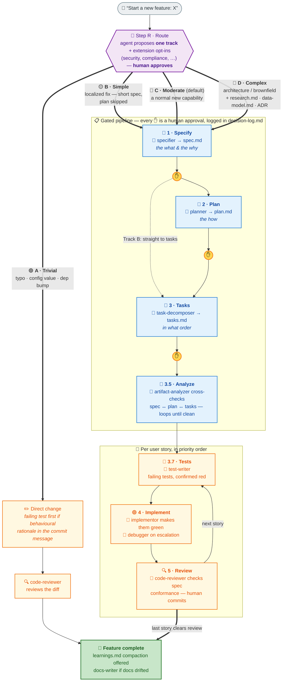
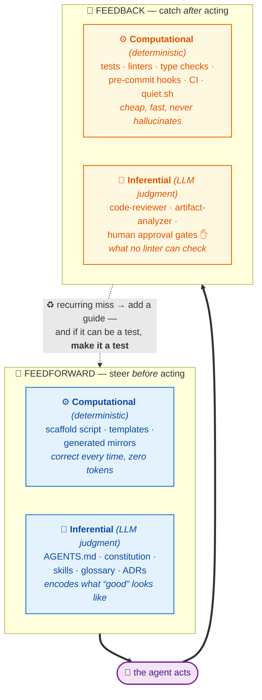
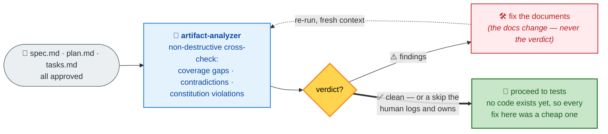
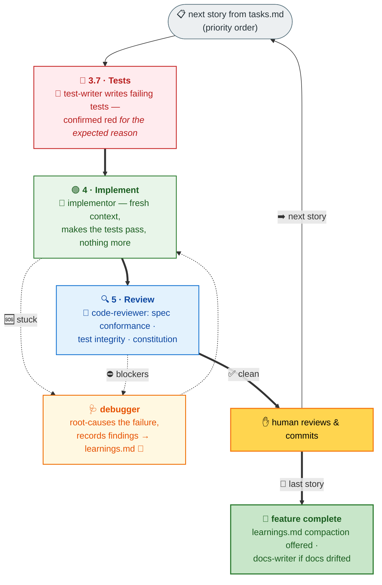
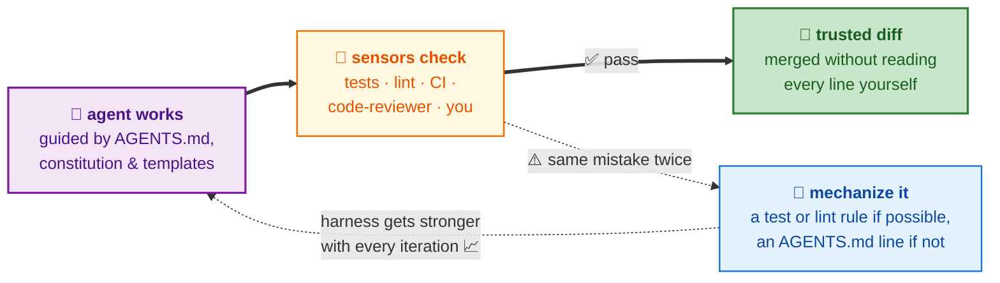

<div align="center">

# 🧭 Spec-Driven Development Kit

**A portable harness that turns AI coding agents into a disciplined engineering team.**

Drop it into any repository. Get a gated Specify → Plan → Tasks → Implement pipeline,
nine focused agents, deterministic guardrails — and a clean upgrade path for all of it.

[](KIT-CHANGELOG.md)
[](LICENSE)
[](#-works-with-your-tools)
[](#-works-with-your-tools)
[](#-works-with-your-tools)
[](scripts/)

[Why this kit](#-why-this-kit) · [How it works](#-the-workflow) · [Quick start](#-add-it-to-an-existing-project) · [Upgrading](#-upgrading) · [Best practices](#-getting-the-best-out-of-it)

</div>

---

## 💡 Why this kit

Prompting an agent to "just build the feature" produces code you have to re-read line by line.
This kit replaces that with a pipeline where **every expensive mistake is caught while it's still
a cheap one** — a wrong spec costs a re-draft at an approval gate, not a rewritten feature.

What sets it apart, in a few words:

> **Versioned and upgradeable.** A machine-enforced ownership contract defines exactly which files
> the kit may update and which are forever yours — so adopting it never means forking it.
>
> **One source, every tool.** Agents and skills are defined once and mirrored byte-for-byte to
> Claude Code, GitHub Copilot, and Codex. Your team's tool choice stops mattering.
>
> **Token-disciplined by architecture.** Thin pointer files, phase protocols read at the point of
> use, fresh sub-agent contexts per phase — context engineering is the design, not a tip.

## ✨ Key features

| | Feature | What you get |
|---|---|---|
| 🚦 | **Gated SDLC pipeline** | Route → Specify → Plan → Tasks → Analyze → Tests (red) → Implement (green) → Review. Human sign-off at every gate, recorded in a committed `decision-log.md`. |
| 📏 | **Right-sized rigor** | Four workflow tracks — a typo fix doesn't get user stories; a new service doesn't get CRUD-level ceremony. The agent proposes, you decide. |
| 🤖 | **Nine focused agents** | `specifier` · `planner` · `task-decomposer` · `artifact-analyzer` · `test-writer` · `implementor` · `debugger` · `code-reviewer` · `docs-writer` — each runs fresh, in its own context, on the model tier its phase needs. |
| 🪞 | **Single source of truth** | Canonical definitions in `.agents/`; generated mirrors for each tool. CI fails if a mirror drifts. |
| 🔄 | **Contractual upgrades** | [`docs/KIT-MANIFEST.md`](docs/KIT-MANIFEST.md) + `scripts/update-kit.sh`: pull new kit versions without ever touching your code, specs, or config. |
| 🧩 | **Opt-in extension packs** | Blocking rule packs (security, compliance, …) layered onto a feature only when you say so. |
| 🧠 | **Project memory** | A constitution of always-true principles, a per-feature decision log, and a `learnings.md` that captures what went sideways — with compaction so it never bloats. |
| 🖥️ | **Cross-platform** | Every script ships as a `.sh` / `.ps1` twin. |

## 🧱 Principles

1. **Every token must earn its place.** Small always-loaded files; deep reference docs pulled in by name only when needed.
2. **Mechanize what you can, infer what you must.** A rule that can be a test should be a test, not a sentence an agent re-reads.
3. **Humans decide where mistakes are cheap.** Gates sit at spec, plan, and tasks — the points where course-correcting costs a paragraph, not a feature.
4. **Test-first, non-negotiable.** Red before green; regression guards for bug fixes; characterization tests before touching untested legacy code.
5. **Depth is a decision, not a constant.** Rigor scales with the work, and the routing itself is logged and auditable.
6. **No over-engineering.** Only what is directly requested — enforced as a guardrail in every skill session.

## 🗺️ The workflow

One skill — `develop-feature` — drives everything. It first **routes** the work to a
right-sized track, then walks the gated pipeline, delegating each document to a dedicated agent:


```mermaid
flowchart TD
    START(["💬 “Start a new feature: X”"]) --> R

    R{{"🚦 Step R · Route<br/>agent proposes <b>one track</b> + extension opt-ins<br/>(security, compliance, …) — <b>human approves</b>"}}

    R ==>|"🟢 <b>A · Trivial</b><br/>typo · config value · dep bump"| TA
    R ==>|"🟡 <b>B · Simple</b><br/>localized fix — short spec,<br/>plan skipped"| SP
    R ==>|"🔵 <b>C · Moderate</b> (default)<br/>a normal new capability"| SP
    R ==>|"🔴 <b>D · Complex</b><br/>architecture / brownfield<br/>+ research.md · data-model.md · ADR"| SP

    TA["✏️ Direct change<br/><i>failing test first if behavioural<br/>rationale in the commit message</i>"] --> RVA["🔍 code-reviewer<br/>reviews the diff"]
    RVA --> DONE

    subgraph GATED["&nbsp;📋 Gated pipeline — every ✋ is a human approval, logged in decision-log.md&nbsp;"]
        direction TB
        SP["📝 <b>1 · Specify</b><br/>🤖 specifier → spec.md<br/><i>the what & the why</i>"] --> G1(("✋"))
        G1 --> PL["📐 <b>2 · Plan</b><br/>🤖 planner → plan.md<br/><i>the how</i>"]
        G1 -.->|"Track B: straight to tasks"| TK
        PL --> G2(("✋")) --> TK["🧩 <b>3 · Tasks</b><br/>🤖 task-decomposer → tasks.md<br/><i>in what order</i>"]
        TK --> G3(("✋")) --> AN["🔎 <b>3.5 · Analyze</b><br/>🤖 artifact-analyzer cross-checks<br/>spec ↔ plan ↔ tasks — loops until clean"]
    end

    AN --> TW

    subgraph STORY["&nbsp;🔁 Per user story, in priority order&nbsp;"]
        direction LR
        TW["🔴 <b>3.7 · Tests</b><br/>🤖 test-writer<br/>failing tests, confirmed red"] --> IM["🟢 <b>4 · Implement</b><br/>🤖 implementor makes them green<br/>🤖 debugger on escalation"]
        IM --> RV["🔍 <b>5 · Review</b><br/>🤖 code-reviewer checks spec<br/>conformance — human commits"]
        RV -->|"next story"| TW
    end

    RV ==>|"last story clears review"| DONE["🏁 <b>Feature complete</b><br/>learnings.md compaction offered<br/>docs-writer if docs drifted"]

    classDef routing fill:#f3e5f5,stroke:#7b1fa2,stroke-width:2px,color:#4a148c
    classDef phase fill:#e3f2fd,stroke:#1976d2,stroke-width:1.5px,color:#0d47a1
    classDef gate fill:#ffd54f,stroke:#f57f17,stroke-width:2px,color:#000
    classDef story fill:#fff8e1,stroke:#ef6c00,stroke-width:1.5px,color:#e65100
    classDef done fill:#c8e6c9,stroke:#2e7d32,stroke-width:2px,color:#1b5e20
    classDef entry fill:#eceff1,stroke:#546e7a,color:#263238

    class R routing
    class SP,PL,TK,AN phase
    class G1,G2,G3 gate
    class TW,IM,RV story
    class TA,RVA story
    class DONE done
    class START entry
```

> [!NOTE]
> Every approval flips the document's `Status` to `Approved` and appends a `decision-log.md`
> row — which is also how a feature spanning days of separate sessions **resumes exactly where
> it left off**, with no scratch files.

## 🛡️ The harness

Spec-driven development *is* a harness: **feedforward guides** steer the agent before it acts,
**feedback sensors** catch it after — and the loop between them is where the harness improves.


```mermaid
flowchart TD
    subgraph FF["&nbsp;🧭 FEEDFORWARD — steer <i>before</i> acting&nbsp;"]
        direction LR
        FFC["⚙️ <b>Computational</b> <i>(deterministic)</i><br/>scaffold script · templates ·<br/>generated mirrors<br/><i>correct every time, zero tokens</i>"]
        FFI["🧠 <b>Inferential</b> <i>(LLM judgment)</i><br/>AGENTS.md · constitution ·<br/>skills · glossary · ADRs<br/><i>encodes what “good” looks like</i>"]
    end

    AGENT(["🤖 the agent acts"])

    subgraph FB["&nbsp;📡 FEEDBACK — catch <i>after</i> acting&nbsp;"]
        direction LR
        FBC["⚙️ <b>Computational</b> <i>(deterministic)</i><br/>tests · linters · type checks ·<br/>pre-commit hooks · CI · quiet.sh<br/><i>cheap, fast, never hallucinates</i>"]
        FBI["🧠 <b>Inferential</b> <i>(LLM judgment)</i><br/>code-reviewer · artifact-analyzer ·<br/>human approval gates ✋<br/><i>what no linter can check</i>"]
    end

    FF ==> AGENT ==> FB
    FB -.->|"♻️ recurring miss → add a guide —<br/>and if it can be a test, <b>make it a test</b>"| FF

    classDef guide fill:#e3f2fd,stroke:#1976d2,stroke-width:1.5px,color:#0d47a1
    classDef sensor fill:#fff8e1,stroke:#ef6c00,stroke-width:1.5px,color:#e65100
    classDef actor fill:#f3e5f5,stroke:#7b1fa2,stroke-width:2px,color:#4a148c
    class FFC,FFI guide
    class FBC,FBI sensor
    class AGENT actor
```

The feedforward half ships filled-in. The feedback half is deliberately yours to wire to your
stack (test command, lint, CI) — start with tests and a linter, then a CI job mirroring them;
`scripts/quiet.sh` keeps their output token-cheap: pass/fail + first error to the agent, full
log to a file.

## 🔁 The loops

**Analyze loop** *(Phase 3.5)* — the artifacts must agree before any code exists:


```mermaid
flowchart LR
    IN(["📄 spec.md · plan.md · tasks.md<br/>all approved"]) --> AZ

    AZ["🔎 <b>artifact-analyzer</b><br/>non-destructive cross-check:<br/>coverage gaps · contradictions ·<br/>constitution violations"] --> V{"verdict?"}
    V -->|"⚠️ findings"| FX["🛠️ fix the documents<br/><i>(the docs change — never the verdict)</i>"]
    FX -.->|"re-run, fresh context"| AZ
    V ==>|"✅ clean — or a skip the<br/>human logs and owns"| GO["🧪 proceed to tests<br/>no code exists yet, so every<br/>fix here was a cheap one"]

    classDef input fill:#eceff1,stroke:#546e7a,color:#263238
    classDef check fill:#e3f2fd,stroke:#1976d2,stroke-width:1.5px,color:#0d47a1
    classDef verdict fill:#ffd54f,stroke:#f57f17,stroke-width:2px,color:#000
    classDef fix fill:#ffebee,stroke:#c62828,stroke-width:1.5px,color:#b71c1c
    classDef ok fill:#c8e6c9,stroke:#2e7d32,stroke-width:2px,color:#1b5e20
    class IN input
    class AZ check
    class V verdict
    class FX fix
    class GO ok
```

**Story loop** *(Phases 3.7 → 4 → 5, repeated per user story in priority order)*:


```mermaid
flowchart TD
    PICK(["📋 next story from tasks.md<br/>(priority order)"]) --> TW

    TW["🔴 <b>3.7 · Tests</b><br/>🤖 test-writer writes failing tests —<br/>confirmed red <i>for the expected reason</i>"] ==> IM
    IM["🟢 <b>4 · Implement</b><br/>🤖 implementor — fresh context,<br/>makes the tests pass, nothing more"]

    IM -.->|"🆘 stuck"| DB["🩺 <b>debugger</b><br/>root-causes the failure,<br/>records findings → learnings.md 🧠"]
    DB -.-> IM

    IM ==> RV["🔍 <b>5 · Review</b><br/>🤖 code-reviewer: spec conformance ·<br/>test integrity · constitution"]
    RV -.->|"⛔ blockers"| DB
    RV ==>|"✅ clean"| CM["✋ human reviews & commits"]

    CM -->|"➡️ next story"| PICK
    CM ==>|"🏁 last story"| FIN["🎉 <b>feature complete</b><br/>learnings.md compaction offered ·<br/>docs-writer if docs drifted"]

    classDef red fill:#ffebee,stroke:#c62828,stroke-width:1.5px,color:#b71c1c
    classDef green fill:#e8f5e9,stroke:#2e7d32,stroke-width:1.5px,color:#1b5e20
    classDef review fill:#e3f2fd,stroke:#1976d2,stroke-width:1.5px,color:#0d47a1
    classDef debug fill:#fff8e1,stroke:#ef6c00,stroke-width:1.5px,color:#e65100
    classDef human fill:#ffd54f,stroke:#f57f17,stroke-width:2px,color:#000
    classDef done fill:#c8e6c9,stroke:#2e7d32,stroke-width:2px,color:#1b5e20
    classDef input fill:#eceff1,stroke:#546e7a,color:#263238

    class TW red
    class IM green
    class RV review
    class DB debug
    class CM human
    class FIN done
    class PICK input
```

**Harness-improvement loop** *(the meta-loop, run by you)*:


```mermaid
flowchart LR
    W["🤖 <b>agent works</b><br/>guided by AGENTS.md,<br/>constitution & templates"] ==> S["📡 <b>sensors check</b><br/>tests · lint · CI ·<br/>code-reviewer · you"]
    S ==>|"✅ pass"| T["🤝 <b>trusted diff</b><br/>merged without reading<br/>every line yourself"]
    S -.->|"⚠️ same mistake twice"| M["🔧 <b>mechanize it</b><br/>a test or lint rule if possible,<br/>an AGENTS.md line if not"]
    M -.->|"harness gets stronger<br/>with every iteration 📈"| W

    classDef work fill:#f3e5f5,stroke:#7b1fa2,stroke-width:2px,color:#4a148c
    classDef sensor fill:#fff8e1,stroke:#ef6c00,stroke-width:1.5px,color:#e65100
    classDef trust fill:#c8e6c9,stroke:#2e7d32,stroke-width:2px,color:#1b5e20
    classDef mech fill:#e3f2fd,stroke:#1976d2,stroke-width:1.5px,color:#0d47a1

    class W work
    class S sensor
    class T trust
    class M mech
```

## 🚀 Add it to an existing project

**1 · Get a kit checkout** next to your repo:

```bash
git clone https://github.com/<kit-org>/spec-driven-development /tmp/sdd-kit
```

**2 · Seed and pull the kit-owned files in** (from your project root):

```bash
echo "0.0.0" > KIT_VERSION
/tmp/sdd-kit/scripts/update-kit.sh /tmp/sdd-kit        # update-kit.ps1 on Windows
```

This copies exactly the kit-owned paths listed in [docs/KIT-MANIFEST.md](docs/KIT-MANIFEST.md)
(`.agents/`, `templates/`, `scripts/`, reference docs, generated tool mirrors) — and nothing
else. Your `src/`, `tests/`, CI, and existing docs are untouched. Add `--dry-run` first to
preview the file list.

**3 · Generate your project config.** In your agent tool, run the **`init-project`** skill. It
scans your codebase, then — with your approval at each gate — writes a filled-in `AGENTS.md` and
`memory/constitution.md`. Keep `CLAUDE.md` / `.github/copilot-instructions.md` as thin pointers
to `AGENTS.md`.

**4 · Optional sensors.** The kit's own pre-commit hook and CI workflow are *not* copied by
default (CI auto-runs on commit, which surprises projects with existing pipelines). Want them?
Copy `.githooks/pre-commit` and/or `.github/workflows/agent-harness.yml` from the kit checkout
by hand — they're yours from then on. For the hook: `git config core.hooksPath .githooks`.

**5 · Ship something.** Run the **`develop-feature`** skill on your first change. 🎉

## ⬆️ Upgrading

```bash
git -C /tmp/sdd-kit pull && git -C /tmp/sdd-kit checkout v0.2.0   # target release
scripts/update-kit.sh /tmp/sdd-kit --dry-run                      # preview
scripts/update-kit.sh /tmp/sdd-kit                                # apply
```

> [!IMPORTANT]
> Only **kit-owned** paths are ever written. Project-owned paths — `AGENTS.md`, `memory/`,
> `specs/`, `src/`, `tests/`, your own ADRs — are never touched. That contract is
> [docs/KIT-MANIFEST.md](docs/KIT-MANIFEST.md), enforced in CI against its machine-readable
> source, `.agents/kit-manifest.conf`.

- Tool mirrors are **regenerated**, not copied — your `model-map.conf` choices flow through.
- Real semver comparison with a **downgrade guard** (`--force` to override intentionally).
- All writes are staged and validated **before anything touches disk**.
- `KIT-CHANGELOG.md` tells you what changed and why; compare your `KIT_VERSION` against
  upstream's any time to see if you're behind.

## 🏆 Getting the best out of it

- **Start every change through `develop-feature`** — even tiny ones. Track A exits in one step;
  the value is that *routing* is deliberate, not that every change gets a spec.
- **Take the gates seriously.** Rubber-stamping the spec gate is how you end up reviewing a whole
  wrong feature instead of one wrong paragraph. Unsure between two tracks? Take the heavier one —
  over-rigor is cheaper to trim than under-rigor is to recover.
- **Wire up your feedback half first.** The single highest-leverage move: put a fast test command
  (single-test form too) and a lint/type-check command in `AGENTS.md`, wrapped in
  `scripts/quiet.sh`. Agents self-correct against sensors they can run themselves.
- **Resolve `[NEEDS CLARIFICATION]` markers early** with `clarify-spec`; audit a spec against its
  checklist with `check-spec`. The pre-commit hook (if adopted) blocks unresolved markers.
- **Keep the constitution short and always-true** — amend it only via `amend-constitution`.
  Record cross-cutting decisions as ADRs with `create-adr`; keep `AGENTS.md` matching reality
  with `sync-agents-md`.
- **Never hand-edit generated mirrors** (`.claude/`, `.github/agents|skills/`, `.codex/`) or
  kit-owned files. Edit the canonical `.agents/` source (if it's yours) or open an extension
  pack, then re-run the mirror scripts. CI catches drift either way.
- **Let each document do its job**: spec = *what and why* · plan = *how* · tasks = *in what
  order*. If something is only sometimes true, it belongs in a spec — not `AGENTS.md`, and never
  the constitution.

## 🔧 Works with your tools

Definitions live once under `.agents/` and are mirrored automatically:

| Tool | Mirror | Generated by |
|---|---|---|
| Claude Code | `.claude/` | `scripts/mirror-agents.sh` / `mirror-skills.sh` |
| GitHub Copilot | `.github/agents/` · `.github/skills/` | same |
| Codex | `.codex/` | same |

## 📁 Repository layout

| Path | What it is |
|---|---|
| `.agents/` | Canonical agents, skills, extensions, and config — the single source of truth |
| `.claude/` · `.github/` · `.codex/` | Generated per-tool mirrors — never hand-edit |
| `templates/` | Spec, plan, tasks, checklist, constitution, and other document templates |
| `scripts/` | Mirror generators, `quiet` log condenser, `update-kit` — all with `.ps1` twins |
| `docs/` | Deep reference guides, loaded on demand — start at [docs/README.md](docs/README.md) |
| `docs/adr/` | Architecture decision records for the kit's own design |
| `memory/` | Project memory — the constitution lives here |
| `specs/` | Per-feature working folders: spec, plan, tasks, decision log, learnings |

---

<div align="center">

**Specs before code. Gates before regret.**

Licensed under [Apache 2.0](LICENSE) · Changes in [KIT-CHANGELOG.md](KIT-CHANGELOG.md)

</div>
